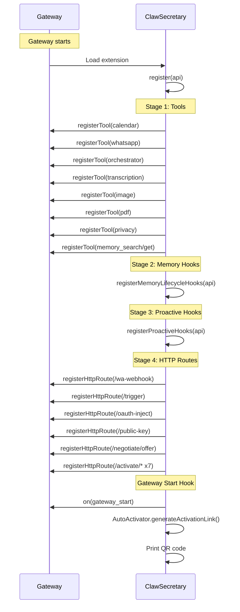
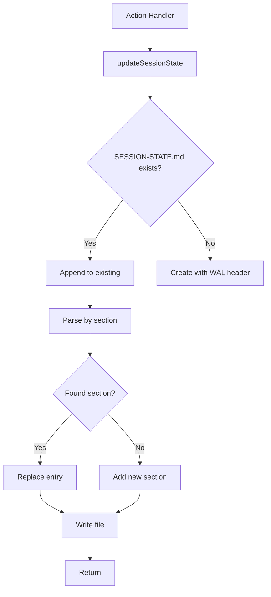
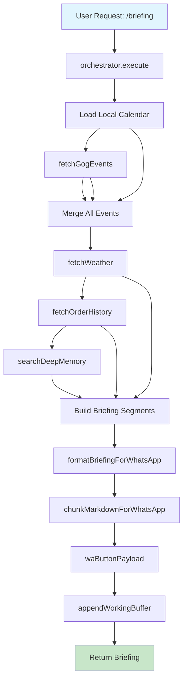
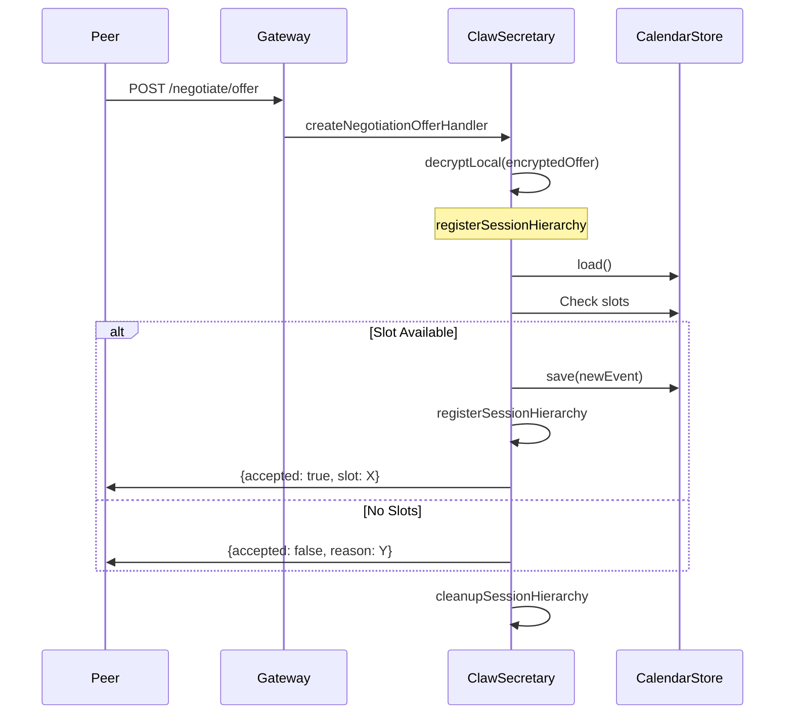
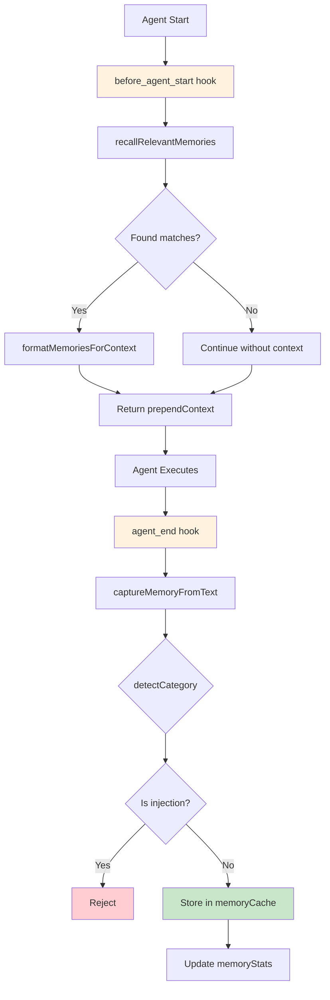

# ClawSecretary Architecture Guide

**Version:** 2.0  
**Last Updated:** March 18, 2026  
**OpenClaw Integration:** 98%

---

## Table of Contents

1. [Executive Summary](#executive-summary)
2. [System Architecture](#system-architecture)
3. [Core Components](#core-components)
4. [Module Reference](#module-reference)
5. [Data Flow Diagrams](#data-flow-diagrams)
6. [API Integration Matrix](#api-integration-matrix)
7. [Security Architecture](#security-architecture)
8. [Storage & Persistence](#storage--persistence)
9. [Extension Points](#extension-points)
10. [Performance Considerations](#performance-considerations)
11. [Future Roadmap](#future-roadmap)

---

## Executive Summary

### What is ClawSecretary?

ClawSecretary is an OpenClaw plugin that transforms your AI assistant into a proactive personal secretary. It operates on the principle of **intelligent proactivity** - not waiting for commands, but anticipating needs based on context.

### Core Philosophy

> **"STOP and PERSIST before you REPLY."** — WAL Protocol

The Secretary maintains persistent state via the Write-Ahead Logging (WAL) protocol, ensuring every action is auditable and context is preserved across sessions.

### Technical Pillars

| Pillar | Description | Implementation |
|--------|-------------|----------------|
| **Proactivity** | Anticipate needs before explicit commands | Cron-based hooks, `gateway_start` |
| **Persistence** | Maintain state across sessions | WAL + SESSION-STATE.md |
| **Security** | Protect sensitive data | RSA encryption, Vault |
| **Integration** | Connect to external services | OpenClaw Runtime APIs |
| **Automation** | Reduce manual intervention | Autonomy levels, workflows |

---

## System Architecture

### High-Level Overview

```
┌─────────────────────────────────────────────────────────────────────────────┐
│                              OpenClaw Gateway                                │
│  ┌─────────────────────────────────────────────────────────────────────┐  │
│  │                     Extension Plugin System                            │  │
│  │  ┌───────────────────────────────────────────────────────────────┐  │  │
│  │  │                  ClawSecretary Plugin                          │  │  │
│  │  │                                                                │  │  │
│  │  │  ┌────────────┐  ┌────────────┐  ┌────────────────────────┐  │  │  │
│  │  │  │   Tools    │  │   Hooks    │  │      HTTP Routes       │  │  │  │
│  │  │  │            │  │            │  │                        │  │  │  │
│  │  │  │ • Calendar │  │ • gateway_ │  │ • /wa-webhook          │  │  │  │
│  │  │  │ • WA Tool  │  │   start    │  │ • /trigger             │  │  │  │
│  │  │  │ • Orches-  │  │ • before_  │  │ • /oauth-inject        │  │  │  │
│  │  │  │   trator   │  │   prompt   │  │ • /negotiate/offer     │  │  │  │
│  │  │  │ • Trans-   │  │ • agent_   │  │ • /activate/* (7)      │  │  │  │
│  │  │  │   cription  │  │   end      │  │                        │  │  │  │
│  │  │  │ • Image    │  │ • message  │  │                        │  │  │  │
│  │  │  │   Generat. │  │   _recv    │  │                        │  │  │  │
│  │  │  │ • PDF      │  │ • subagent │  │                        │  │  │  │
│  │  │  │   Extract  │  │   _ended   │  │                        │  │  │  │
│  │  │  │ • Privacy  │  │            │  │                        │  │  │  │
│  │  │  └────────────┘  └────────────┘  └────────────────────────┘  │  │  │
│  │  │                                                                │  │  │
│  │  └───────────────────────────────────────────────────────────────┘  │  │
│  └─────────────────────────────────────────────────────────────────────┘  │
│                                                                             │
│  ┌─────────────────────────────────────────────────────────────────────┐  │
│  │                     OpenClaw Runtime                                  │  │
│  │  ┌─────────────┐ ┌─────────────┐ ┌─────────────┐ ┌─────────────┐  │  │
│  │  │   Media     │ │  Web Search │ │   Image     │ │   Subagent  │  │  │
│  │  │ Understand. │ │   Runtime   │ │  Generation │ │   Runtime   │  │  │
│  │  └─────────────┘ └─────────────┘ └─────────────┘ └─────────────┘  │  │
│  │  ┌─────────────┐ ┌─────────────┐ ┌─────────────┐ ┌─────────────┐  │  │
│  │  │    TTS      │ │   Channel   │ │  Messaging  │ │   Memory    │  │  │
│  │  │  Runtime    │ │   Text API  │ │   Runtime   │ │   Search    │  │  │
│  │  └─────────────┘ └─────────────┘ └─────────────┘ └─────────────┘  │  │
│  └─────────────────────────────────────────────────────────────────────┘  │
└─────────────────────────────────────────────────────────────────────────────┘
```

### Plugin Registration Flow



---

## Core Components

### 1. Orchestrator

**File:** `src/orchestrator.ts` (1180 lines)

The central dispatcher for all Secretary actions. Maintains the action registry and delegates to appropriate handlers.

```
┌─────────────────────────────────────────────────────────┐
│                  SecretaryOrchestrator                   │
├─────────────────────────────────────────────────────────┤
│  Properties:                                            │
│  ├── store: CalendarStore       # Local event storage    │
│  ├── vault: VaultManager       # Secrets management      │
│  ├── crm: CRMManager           # Third-party sync        │
│  └── workspaceDir: string      # Base path               │
├─────────────────────────────────────────────────────────┤
│  Public Methods:                                        │
│  ├── execute(runId, params, ctx) → ToolResult          │
│  └── registerProactiveHooks(api) → void                │
├─────────────────────────────────────────────────────────┤
│  Actions (40+):                                        │
│  ├── Calendar: briefing, conflict_guardian, gog_sync   │
│  ├── Email: gmail_triager, email_concierge             │
│  ├── Intelligence: proactive_research, rss_digest      │
│  ├── IoT: trigger_focus_mode, get_iot_activity        │
│  ├── Knowledge: sync_knowledge, finalize_closure       │
│  └── P2P: negotiate_meeting                           │
└─────────────────────────────────────────────────────────┘
```

**Key Design Decisions:**

1. **Dependency Injection** - All dependencies passed via constructor
2. **Action Enum** - Type-safe action selection
3. **Handler Pattern** - Each action has dedicated method
4. **WAL Integration** - Every handler updates session state

### 2. WAL Helpers

**File:** `src/wal-helpers.ts` (286 lines)

Implements persistent state via the WAL protocol.



**WAL Header Template:**
```markdown
# Active Working Memory (WAL) 🦞

**Status**: READY

---
```

### 3. Negotiation Module

**File:** `src/negotiation.ts` (180 lines)

P2P meeting coordination with RSA encryption.

```
┌─────────────────────────────────────────────┐
│           Negotiation Protocol              │
├─────────────────────────────────────────────┤
│                                             │
│  Peer                              Secretary │
│    │                                    │   │
│    │─────── Public Key ────────────────▶│   │
│    │                                    │   │
│    │      (RSA-2048 encrypted)         │   │
│    │◀─────── Offer ────────────────────│   │
│    │                                    │   │
│    │  {                                 │   │
│    │    slots: [9:00, 14:00],          │   │
│    │    title: "Meeting",               │   │
│    │    duration: 60                   │   │
│    │  }                                 │   │
│    │                                    │   │
│    │  (Decrypt & check calendar)       │   │
│    │                                    │   │
│    │─────── Reply ─────────────────────▶│   │
│    │    {accepted: true, slot: 9:00}   │   │
│    │                                    │   │
└─────────────────────────────────────────────┘
```

**Session Hierarchy Integration:**
```typescript
await registerSessionHierarchy(
  api,
  negotiationSessionKey,
  "peer",  // role
  parentSessionKey,  // parent for hierarchy
  { peerUrl, title, durationMin }
);
```

### 4. Calendar Store

**File:** `src/store.ts` (35 lines)

Simple JSON-based event persistence.

```typescript
interface CalendarEvent {
  id: string;
  title: string;
  startTime: string;  // ISO
  endTime: string;    // ISO
  description?: string;
  location?: string;
  source: "local" | "google" | "outlook" | "calendly" | "p2p";
  researched?: boolean;
}

class CalendarStore {
  async load(): Promise<CalendarEvent[]>
  async save(events: CalendarEvent[]): Promise<void>
}
```

---

## Module Reference

### Helpers Directory

```
src/helpers/
├── intelligence.ts          # Web search, RSS, weather, venues
├── iot.ts                  # Hue/Sonos control + activity tracking
├── memory-lifecycle.ts     # Memory hooks and caching
├── text-processor.ts       # Native chunking and formatting
├── knowledge.ts            # Second brain sync
├── parallel-subagent-helper.ts  # Concurrent execution
├── pairing.ts              # Magic setup QR generation
├── alerts.ts               # Urgent notifications
├── autonomy.ts             # Autonomy level parsing
├── calendly.ts             # Calendly API client
├── common.ts               # CLI execution utilities
├── email.ts                # Gmail/Outlook/Himalaya
├── tts-voice-selector.ts   # Context-aware voice selection
├── whatsapp.ts              # WA button/list builders
└── activation.ts           # Zero-config activation
```

### Helper: Intelligence (`intelligence.ts`)

**Purpose:** Web research, RSS feeds, weather, venue discovery

**APIs Used:**
- `runtime.webSearch.runWebSearch()` - Multi-provider search
- CLI: `blogwatcher`, `goplaces`, `ordercli`, `curl`

**Key Functions:**

```typescript
// Web search with auto-provider detection
async function performWebSearch(
  query: string,
  options?: { providerId?: string; maxResults?: number }
): Promise<{ title: string; url: string; snippet?: string }[]>

// RSS feed aggregation
async function fetchRssDigest(): Promise<{ title: string; blog: string; url?: string }[]>

// Weather via wttr.in
async function fetchWeather(city: string): Promise<string>

// Nearby venues
async function fetchNearbyVenues(query: string, lat?: number, lng?: number): Promise<...>
```

### Helper: IoT (`iot.ts`)

**Purpose:** Smart home control and activity analytics

**Devices:**
- Philips Hue (via `openhue` CLI)
- Sonos (via `sonos` CLI)

**Activity Tracking:**
```typescript
// Every action records to runtime.channel.activity
await recordIoTActivity(api, {
  device: "philips-hue",
  action: "set_scene",
  target: "Oficina/Concentración",
  success: true,
  timestamp: new Date().toISOString()
});

// Query capabilities
getIoTActivityStats()  // { total, successful, failed, byDevice }
getIoTActivityLog(50)   // Recent events
```

### Helper: Memory Lifecycle (`memory-lifecycle.ts`)

**Purpose:** Context-aware memory across agent sessions

**Hooks Implemented:**
- `before_agent_start` - Recall relevant memories
- `agent_end` - Capture task completions

**Memory Categories:**
```typescript
type MemoryCategory = "preference" | "decision" | "fact" | "entity" | "other";

interface MemoryEntry {
  id: string;
  content: string;
  category: MemoryCategory;
  timestamp: string;
  source?: string;
  confidence?: number;
}
```

**Security: Prompt Injection Guard**
```typescript
const PROMPT_INJECTION_PATTERNS = [
  /ignore (all|any|previous)/i,
  /do not follow (system|developer)/i,
  /disregard (all|previous)/i,
  // ...
];

function looksLikePromptInjection(text: string): boolean {
  return PROMPT_INJECTION_PATTERNS.some(pattern => pattern.test(text));
}
```

### Helper: Text Processor (`text-processor.ts`)

**Purpose:** Native OpenClaw text processing integration

**Chunking Modes:**
```typescript
type ChunkMode = "length" | "newline";

// Length-based chunking (4000 chars for WhatsApp)
chunkTextForWhatsApp(text, 4000, "length")

// Paragraph-aware chunking (preserves meaning)
chunkByParagraphForDocuments(text, 4000, { splitLongParagraphs: true })

// Markdown-safe with fence detection
chunkMarkdownForWhatsApp(markdown, 4000, "length")
```

**Table Conversion:**
```typescript
// Markdown tables → WhatsApp format
convertTablesForChannel(markdown, "whatsapp")
// | A | B |  →  ┌───┬───┐
// |---|---|  →  │ A │ B │
// | 1 | 2 |  →  ├───┼───┤
//                │ 1 │ 2 │
//                └───┴───┘
```

### Helper: Knowledge (`knowledge.ts`)

**Purpose:** Second brain synchronization

**Sync Pipeline:**
```
┌──────────────┐
│ Ghost Write  │
│   Content    │
└──────┬───────┘
       │
       ├──────────────────────┐
       ▼                      ▼
┌──────────────┐       ┌──────────────┐
│ VectorDB     │       │  Paragraph   │
│ (LanceDB)    │       │  Chunking    │
└──────────────┘       └──────────────┘
       │
       ├────────────┬────────────┐
       ▼            ▼            ▼
  ┌─────────┐ ┌─────────┐ ┌─────────┐
  │ Notion  │ │Obsidian │ │Transcript│
  │ Database│ │  Vault  │ │ Append  │
  └─────────┘ └─────────┘ └─────────┘
```

**Ghost Write Flow:**
```typescript
const { transcript, knowledge, chunkInfo } = await syncGhostWriteToSecondBrain(
  api,
  sessionKey,
  title,
  content
);
// Returns sync destinations and chunking info
```

### Helper: Parallel Subagent (`parallel-subagent-helper.ts`)

**Purpose:** Concurrent task execution

**Pattern:**
```typescript
const results = await executeParallelSubagents(api, [
  { message: "Task 1", sessionKey: "session-1" },
  { message: "Task 2", sessionKey: "session-2" }
]);

// Waits for all completions, returns results
results[0].success  // boolean
results[0].messages // array of messages
```

**Pre-built Scenarios:**
```typescript
ParallelScenarios.briefingAndCalendarSync()
ParallelScenarios.analyzeMultipleEmails(emails)
ParallelScenarios.parallelResearch(topics)
```

### Helper: Pairing (`pairing.ts`)

**Purpose:** Magic Setup via QR code

```typescript
// Generate pairing URL
const link = await generatePairingLink(api);
// Returns: http://192.168.1.x:11434/plugins/secretary/dashboard?pair=...

// Print QR to terminal
printMagicLink(api, link);
```

---

## Data Flow Diagrams

### Briefing Generation Flow



### P2P Negotiation Flow



### Memory Lifecycle Flow



---

## API Integration Matrix

### Runtime APIs (14 Total)

| API | Module | Phase | Status |
|-----|--------|-------|--------|
| `runtime.mediaUnderstanding.transcribeAudioFile()` | transcription-tool.ts | Phase 1 | ✅ |
| `runtime.webSearch.runWebSearch()` | intelligence.ts | Phase 1 | ✅ |
| `runtime.imageGeneration.generate()` | image-generation-tool.ts | Phase 1 | ✅ |
| `runtime.tts.listVoices()` | tts-voice-selector.ts | Phase 2 | ✅ |
| `runtime.tts.textToSpeech()` | whatsapp-tool.ts | Phase 2 | ✅ |
| `runtime.subagent.run()` | parallel-subagent-helper.ts | Phase 2 | ✅ |
| `runtime.subagent.waitForRun()` | parallel-subagent-helper.ts | Phase 2 | ✅ |
| `runtime.subagent.getSessionMessages()` | parallel-subagent-helper.ts | Phase 2 | ✅ |
| `runtime.subagent.deleteSession()` | wal-helpers.ts | Phase 2 | ✅ |
| `runtime.channel.text.chunkTextWithMode()` | text-processor.ts | Phase 2 | ✅ |
| `runtime.channel.text.chunkMarkdownTextWithMode()` | text-processor.ts | Phase 2 | ✅ |
| `runtime.channel.text.convertMarkdownTables()` | text-processor.ts | Phase 2 | ✅ |
| `runtime.channel.text.hasControlCommand()` | text-processor.ts | Phase 2 | ✅ |
| `runtime.channel.activity.record()` | iot.ts | Phase 2 | ✅ |

### Lifecycle Hooks

| Hook | Handler | Purpose |
|------|---------|---------|
| `gateway_start` | `registerProactiveHooks` | Initialize cron jobs |
| `before_prompt_build` | `registerProactiveHooks` | Inject recent context |
| `agent_end` | `registerMemoryLifecycleHooks` | Capture memories |
| `before_agent_start` | `registerMemoryLifecycleHooks` | Recall memories |
| `message_received` | `registerProactiveHooks` | Financial triage |
| `message_sending` | `registerProactiveHooks` | Verification sig |
| `subagent_ended` | `registerProactiveHooks` | WAL sync |
| `tool_result_persist` | `registerProactiveHooks` | Conflict detection |
| `node_event` | `registerProactiveHooks` | Biometric alerts |

### HTTP Routes

| Path | Handler | Auth | Purpose |
|------|---------|------|---------|
| `/plugins/secretary/wa-webhook` | createWhatsAppWebhookHandler | plugin | WhatsApp events |
| `/plugins/secretary/trigger` | createShortcutTriggerHandler | plugin | Local triggers |
| `/plugins/secretary/oauth-inject` | createOAuthInjectHandler | plugin | Mobile OAuth |
| `/plugins/secretary/public-key` | createPublicKeyHandler | plugin | RSA key exchange |
| `/plugins/secretary/negotiate/offer` | createNegotiationOfferHandler | plugin | P2P negotiation |
| `/plugins/secretary/activate/info` | createActivationInfoHandler | plugin | System status |
| `/plugins/secretary/activate/start` | createActivationStartHandler | plugin | Generate code |
| `/plugins/secretary/activate/pair` | createActivationPairHandler | plugin | Device pairing |
| `/plugins/secretary/activate/verify` | createActivationVerifyHandler | plugin | Code validation |
| `/plugins/secretary/activate/status` | createActivationStatusHandler | plugin | Session status |
| `/plugins/secretary/activate/whatsapp-connect` | createWhatsAppConnectHandler | plugin | WA connection |
| `/plugins/secretary/activate/oauth` | createOAuthProviderHandler | plugin | OAuth setup |

---

## Security Architecture

### RSA Encryption Flow

```
┌──────────────────────────────────────────────────────────┐
│                    Key Generation                         │
│  ┌────────────────┐                                      │
│  │ generateKeyPair│ → Private Key (stored in vault)     │
│  │                 │ → Public Key (shared with peers)    │
│  └────────────────┘                                      │
└──────────────────────────────────────────────────────────┘
                           │
                           ▼
┌──────────────────────────────────────────────────────────┐
│                   Encryption Process                       │
│  Payload ──▶ JSON.stringify ──▶ Buffer ──▶ publicEncrypt │
│                                               (peer key)  │
│                                            ──▶ Base64    │
└──────────────────────────────────────────────────────────┘
                           │
                           ▼
┌──────────────────────────────────────────────────────────┐
│                   Decryption Process                      │
│  Base64 ──▶ Buffer ──▶ privateDecrypt ──▶ JSON.parse   │
│                                     (our private key)    │
└──────────────────────────────────────────────────────────┘
```

### Vault Security

Secrets stored in encrypted vault:
```typescript
class VaultManager {
  async getSecret(item: string, field: string): Promise<string>
  // Keys stored encrypted, fields retrieved on-demand
}
```

### Prompt Injection Protection

Memory lifecycle includes injection detection:
```typescript
function looksLikePromptInjection(text: string): boolean {
  return PROMPT_INJECTION_PATTERNS.some(pattern => pattern.test(text));
}
```

---

## Storage & Persistence

### File Structure

```
workspace/
├── SESSION-STATE.md          # WAL persistent state
├── calendar.json              # Local calendar events
├── memory/
│   └── working-buffer.md      # Agent conversation buffer
└── secretary-pending-messages.json  # WA queue
```

### SESSION-STATE.md Schema

```markdown
# Active Working Memory (WAL) 🦞

**Status**: READY

---

## {SectionName}

### [{ISO Timestamp}] {Entry Title}
- **Key**: Value
- **Another**: Detail

---

## AnotherSection
...
```

**Dynamic Sections:**
- `SessionHierarchy` - Nested session tracking
- `Last Sync` - Calendar sync status
- `Conflicts` - Detected schedule conflicts
- `IoT` - Smart home actions
- `Closure` - Ghost write completions
- `SUBAGENT_SYNC` - Delegation outcomes
- `P2P` - Negotiation state

---

## Extension Points

### 1. Custom Actions

Add new orchestrator action:

```typescript
// 1. Add to enum
parameters = Type.Object({
  action: Type.String({
    enum: [..., "my_new_action"]
  }),
  ...
})

// 2. Add handler
private async handleMyNewAction(params: any) {
  // Implementation
  return { content: [...] };
}

// 3. Add switch case
case "my_new_action": return this.handleMyNewAction(params);
```

### 2. Custom Helpers

```typescript
// src/helpers/my-helper.ts
export async function myHelper(api: OpenClawPluginApi, params: any) {
  // Use runtime APIs
  const result = await api.runtime.someApi(params);
  // Return processed result
  return result;
}
```

### 3. Custom Hooks

```typescript
// In registerProactiveHooks or new function
api.on("my_custom_event", async (event) => {
  // React to event
  return { /* modifications */ };
});
```

### 4. Custom HTTP Routes

```typescript
// In index.ts
api.registerHttpRoute({
  path: "/plugins/secretary/my-route",
  handler: async (req, res) => {
    // Handle request
    res.statusCode = 200;
    res.end(JSON.stringify({ ok: true }));
    return true;
  },
  auth: "plugin",
  match: "exact"
});
```

---

## Performance Considerations

### Parallel Execution

Long-running operations use subagent runtime:
```typescript
// ✅ Good: Parallel for independent tasks
const [a, b] = await Promise.all([
  fetchGogEvents(date),
  fetchOutlookInbox(apiKey)
]);

// ⚠️ Caution: Sequential when dependent
const events = await fetchGogEvents(date);
const enriched = await enrichEvents(events); // Must wait
```

### Chunking Strategy

Text processing uses native APIs:
```typescript
// ✅ Efficient: Native chunking
const chunks = chunkByParagraph(text, 4000, { splitLongParagraphs: true });

// ⚠️ Avoid: In-memory regex for large texts
const parts = text.match(/.{1,4000}/g); // Not paragraph-aware
```

### Memory Management

```typescript
// ✅ Good: Clear after use
const memories = recallRelevantMemories(query, 5);
// memories limited to 5 results

// ⚠️ Caution: Large cache without limit
const cache = new Map(); // Could grow unbounded
```

### Cron Optimization

```typescript
// ✅ Good: Debounced with marker
if (hours === 8 && mins === 0) {
  const marker = api.resolvePath("./.last-morning-briefing");
  const last = await fs.readFile(marker, "utf-8");
  if (last.trim() === today) return; // Already done
  await fs.writeFile(marker, today);
}

// ⚠️ Avoid: Unchecked execution every minute
if (hours === 8) { /* Could run multiple times */ }
```

---

## Future Roadmap

### Phase 3: Memory & Lifecycle Integration
- [ ] Vector memory (LanceDB) integration
- [ ] Persistent memory across sessions
- [ ] Memory-based recommendations

### Phase 4: Activity Intelligence
- [ ] P2P connection health tracking
- [ ] Activity pattern analytics
- [ ] Proactive briefing improvements

### Phase 5: Advanced Text Processing
- [ ] Email threading
- [ ] Multi-language support
- [ ] Voice command NLP

### Phase 6: Canvas/Nodes Runtime
- [ ] UI generation for briefings
- [ ] Interactive dashboards
- [ ] Visual analytics

---

## Appendix: File Inventory

### Source Files (18)

| File | Lines | Purpose |
|------|-------|---------|
| `index.ts` | 198 | Plugin entry point |
| `orchestrator.ts` | 1180 | Main action dispatcher |
| `store.ts` | 35 | Calendar persistence |
| `wal-helpers.ts` | 286 | WAL protocol |
| `negotiation.ts` | 180 | P2P protocol |
| `calendar-tool.ts` | 175 | Calendar tool |
| `whatsapp-tool.ts` | 339 | WhatsApp tool |
| `webhook.ts` | 204 | Webhook handlers |
| `transcription-tool.ts` | ~150 | Audio transcription |
| `image-generation-tool.ts` | ~170 | Image creation |
| `pdf-extraction-tool.ts` | ~100 | PDF processing |
| `privacy-tool.ts` | ~80 | Privacy enforcement |
| `oauth-bridge.ts` | ~120 | Mobile OAuth |
| `auto-activator.ts` | ~150 | Zero-config setup |
| `activation-endpoints.ts` | ~200 | Activation API |
| `vault.ts` | ~80 | Secret management |
| `crm.ts` | ~60 | CRM integrations |
| `constants.ts` | ~50 | Localization |

### Helper Files (15)

| File | Lines | Purpose |
|------|-------|---------|
| `intelligence.ts` | 124 | Web search & research |
| `iot.ts` | 128 | IoT + activity tracking |
| `memory-lifecycle.ts` | 182 | Memory hooks |
| `text-processor.ts` | 378 | Native chunking |
| `knowledge.ts` | 187 | Second brain sync |
| `parallel-subagent-helper.ts` | 209 | Parallel execution |
| `pairing.ts` | 66 | Magic setup |
| `alerts.ts` | ~40 | Notifications |
| `autonomy.ts` | ~30 | Autonomy parsing |
| `calendly.ts` | ~60 | Calendly API |
| `common.ts` | ~50 | CLI utilities |
| `email.ts` | ~100 | Email fetching |
| `tts-voice-selector.ts` | ~250 | Voice selection |
| `whatsapp.ts` | ~80 | WA utilities |
| `activation.ts` | ~100 | Activation logic |

### Total: 33 modules, ~5000 lines of TypeScript

---

## Glossary

| Term | Definition |
|------|------------|
| WAL | Write-Ahead Logging - Persistent state protocol |
| Ghost Write | Automated closure documentation |
| Magic Setup | QR-based zero-configuration pairing |
| Second Brain | External knowledge sync (Notion/Obsidian) |
| Subagent | Parallel execution via OpenClaw runtime |
| P2P | Peer-to-peer encrypted negotiation |
| SPA | Shortest Path Authorization (auth flow) |
| LanceDB | Vector database for memory |
| SPA | Single Page Application (mobile PWA) |

---

**Document Version:** 2.0  
**Last Updated:** March 18, 2026  
**Authors:** ClawSecretary Team  
**License:** MIT
