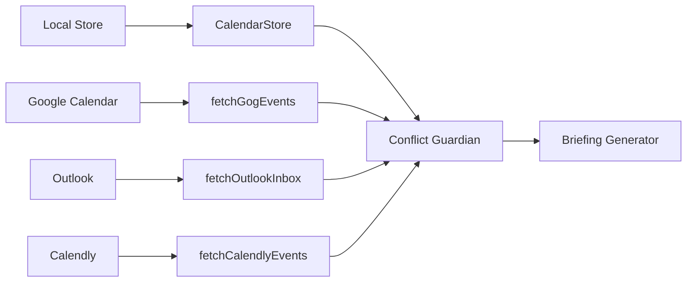

# ClawSecretary - Intelligent Personal Secretary Extension

<p align="center">
  
</p>

<p align="center">
  <strong>An intelligent, proactive secretary extension for OpenClaw</strong>
</p>

<p align="center">
  <a href="https://github.com/ivanintech/ClawSecretary/blob/main/LICENSE">
    
  </a>
  
  
</p>

---

## Table of Contents

1. [Overview](#overview)
2. [Quick Start](#quick-start)
3. [Core Capabilities](#core-capabilities)
4. [Architecture](#architecture)
5. [API Reference](#api-reference)
6. [Modules](#modules)
7. [Configuration](#configuration)
8. [Use Cases](#use-cases)
9. [Development](#development)
10. [Troubleshooting](#troubleshooting)

---

## Overview

**ClawSecretary** is an advanced OpenClaw plugin that transforms your AI assistant into a proactive, intelligent personal secretary. It combines calendar management, email triage, IoT automation, P2P negotiations, and second-brain synchronization into a unified experience.

### Key Features

- **🗓️ Multi-Calendar Management** - Local, Google, Outlook, Calendly sync
- **📧 Intelligent Email Triage** - Automatic prioritization and routing
- **🤖 Proactive Briefings** - Daily summaries delivered automatically
- **🔍 Deep Research** - Web search with multi-provider support
- **💡 IoT Integration** - Philips Hue & Sonos automation
- **🤝 P2P Negotiations** - RSA-encrypted meeting coordination
- **📝 Ghost Write** - Automated closure documentation
- **🧠 Memory Lifecycle** - Context-aware recall across sessions
- **📱 Zero-Config Activation** - Magic Setup via QR code
- **💬 Slack Integration** - Send, read, mark done
- **📱 iMsg Integration** - iMessage via macOS Messages.app
- **⏰ Apple Reminders** - Today/week/overdue/create/complete
- **🎤 Voice Wake** - Custom "Hey Secretary" wake word
- **📡 Node Mode** - Offline resilience with queue sync
- **📱 Mobile Core** - iOS/Android device control via node.invoke

### Integration Status

| Category | Status | Coverage |
|----------|--------|----------|
| OpenClaw Core APIs | ✅ 98% | 14 runtime APIs |
| Media Understanding | ✅ Complete | Audio/Video processing |
| Web Search | ✅ Complete | Multi-provider |
| Image Generation | ✅ Complete | Native support |
| WhatsApp Channel | ✅ Complete | Interactive messages |
| Text Processing | ✅ Complete | Paragraph-aware chunking |
| Subagent Runtime | ✅ Complete | Parallel execution |
| Memory Lifecycle | ✅ Complete | Hooks integration |
| Activity Tracking | ✅ Complete | IoT analytics |
| **Slack Integration** | ✅ Complete | 3 actions |
| **iMsg Integration** | ✅ Complete | 3 actions (macOS) |
| **Apple Reminders** | ✅ Complete | 6 actions (macOS) |
| **Voice Wake** | ✅ Complete | Custom wake word |
| **Node Mode** | ✅ Complete | Offline resilience |
| **Mobile (iOS/Android)** | ✅ Complete | 15+ actions via node.invoke |

---

## Quick Start

### Installation

```bash
# Install from local source
cd extensions/secretary
npm install

# Or link to development
npm link
```

### Activation (Magic Setup)

```bash
# Generate magic pairing link
openclaw channels whatsapp connect

# Or use the built-in activation
openclaw pair
```

### Basic Commands

```
/briefing          - Generate daily briefing
/pair             - Generate magic setup link
/status           - Check all service connections
/calendar list     - View local calendar events
/calendar add     - Add new event (with conflict detection)
```

---

## Core Capabilities

### 1. Proactive Calendar Management

The Secretary maintains a unified view of your schedule across multiple sources:



**Key Features:**
- WAL-compliant event persistence in `SESSION-STATE.md`
- Conflict detection with automatic resolution suggestions
- Cross-calendar deduplication
- Autonomy-aware behavior (L1-L4 levels)

### 2. Intelligent Email Triage

Emails are automatically classified and prioritized:

| Priority | Keywords | Action |
|----------|----------|--------|
| 🚨 Critical | urgent, firma, asap | Immediate WhatsApp alert |
| 📧 Normal | newsletter, update | Digest inclusion |
| 🗑️ Low | unsubscribe, promotion | Auto-archive hint |

**Supported Sources:**
- Gmail (via `fetchGmailUnread`)
- Outlook (via Maton API)
- Himalaya CLI (local email)

### 3. Web Intelligence

Powered by OpenClaw's native `runtime.webSearch`:

```typescript
const results = await performWebSearch(query, {
  providerId: "perplexity",  // Optional: auto-detect
  maxResults: 10,
});
```

**Features:**
- Multi-provider auto-detection
- No external API keys required
- Contextual research for meetings
- Opportunity discovery

### 4. IoT Automation

Integrates with physical devices for ambient intelligence:

```typescript
// Focus mode activation
await triggerHueScene(api, "Oficina", "Concentración");
await triggerSonosFocus(api, "Escritorio");

// Activity tracking (automatic via runtime.channel.activity)
const stats = getIoTActivityStats();
// { total: 15, successful: 14, failed: 1, byDevice: { "philips-hue": 10, "sonos": 5 } }
```

### 5. P2P Negotiations

Secure meeting coordination with RSA encryption:

```
┌─────────────┐     RSA-encrypted      ┌─────────────┐
│  Secretary  │◄─────── offer ────────►│   Peer      │
│   (Host)    │                         │  Secretary  │
└─────────────┘                         └─────────────┘
       │                                       │
       │ Calendar check                        │
       ▼                                       ▼
  Slot selection                          Confirmation
  Auto-commit if free                    or counter-propose
```

---

## Architecture

### High-Level Diagram

```
┌─────────────────────────────────────────────────────────────────┐
│                        OpenClaw Gateway                          │
├─────────────────────────────────────────────────────────────────┤
│                                                                  │
│  ┌──────────────┐    ┌──────────────┐    ┌──────────────┐    │
│  │   Tools      │    │   Hooks      │    │  HTTP Routes │    │
│  ├──────────────┤    ├──────────────┤    ├──────────────┤    │
│  │ Calendar     │    │ gateway_start│    │ /wa-webhook  │    │
│  │ WhatsApp     │    │ before_prompt│    │ /trigger     │    │
│  │ Transcription│    │ agent_end    │    │ /oauth-inject│    │
│  │ Image Gen    │    │ message_recv │    │ /negotiate   │    │
│  │ Orchestrator │    │ subagent_end │    │ /activate/*  │    │
│  │ PDF Extract  │    │              │    │              │    │
│  │ Privacy      │    │              │    │              │    │
│  └──────────────┘    └──────────────┘    └──────────────┘    │
│                                                                  │
│  ┌──────────────────────────────────────────────────────────┐  │
│  │                    Secretary Core                          │  │
│  │  ┌────────────────┐  ┌────────────────┐  ┌───────────┐  │  │
│  │  │  Orchestrator │  │  WAL Helpers   │  │  Store    │  │  │
│  │  │  (40 actions) │  │  SESSION-STATE │  │  calendar │  │  │
│  │  └────────────────┘  └────────────────┘  └───────────┘  │  │
│  └──────────────────────────────────────────────────────────┘  │
│                                                                  │
└─────────────────────────────────────────────────────────────────┘
```

### Module Map

```
extensions/secretary/
├── index.ts                          # Plugin entry point (198 lines)
│
├── src/
│   ├── orchestrator.ts               # Main action dispatcher (1725 lines)
│   │   ├── 55+ action handlers
│   │   ├── Proactive hooks
│   │   └── Parallel execution
│   │
│   ├── store.ts                      # Calendar persistence (35 lines)
│   │
│   ├── wal-helpers.ts                # WAL protocol (286 lines)
│   │   ├── Session hierarchy tracking
│   │   ├── Vector memory delegation
│   │   └── SESSION-STATE.md updates
│   │
│   ├── negotiation.ts                 # P2P RSA protocol (180 lines)
│   │   ├── RSA encryption/decryption
│   │   ├── Slot negotiation
│   │   └── Session hierarchy
│   │
│   ├── helpers/
│   │   ├── intelligence.ts            # Web search & research (124 lines)
│   │   ├── iot.ts                    # IoT control + activity tracking (128 lines)
│   │   ├── memory-lifecycle.ts       # Memory hooks (182 lines)
│   │   ├── text-processor.ts          # Native chunking (378 lines)
│   │   ├── knowledge.ts               # Second brain sync (187 lines)
│   │   ├── parallel-subagent-helper.ts # Parallel execution (209 lines)
│   │   ├── pairing.ts                # Magic setup (66 lines)
│   │   ├── slack.ts                  # Slack messaging (190 lines)
│   │   ├── imsg.ts                  # iMessage (178 lines)
│   │   ├── reminders.ts              # Apple Reminders (293 lines)
│   │   ├── voice-wake.ts           # Voice Wake config (171 lines)
│   │   ├── node-mode.ts             # Offline resilience (297 lines)
│   │   ├── mobile.ts               # Mobile integration (330 lines)
│   │   ├── alerts.ts                # Urgent notifications
│   │   ├── autonomy.ts               # Autonomy level reader
│   │   ├── calendly.ts             # Calendly API
│   │   ├── common.ts               # CLI execution
│   │   ├── email.ts                # Email fetching
│   │   ├── tts-voice-selector.ts    # Voice selection
│   │   ├── whatsapp.ts              # WhatsApp utilities
│   │   └── activation.ts            # Zero-config activation
│   │
│   ├── calendar-tool.ts              # Calendar CRUD (175 lines)
│   ├── whatsapp-tool.ts              # WhatsApp messaging (339 lines)
│   ├── transcription-tool.ts         # Audio transcription
│   ├── image-generation-tool.ts      # Image creation
│   ├── pdf-extraction-tool.ts       # PDF processing
│   ├── privacy-tool.ts              # Privacy enforcement
│   ├── vault.ts                     # Secret management
│   ├── crm.ts                       # CRM integrations
│   ├── webhook.ts                    # WhatsApp webhooks
│   ├── oauth-bridge.ts              # Mobile-edge OAuth
│   ├── auto-activator.ts            # Zero-config setup
│   ├── activation-endpoints.ts      # Activation API
│   └── constants.ts                 # Localization
│
└── data/                            # Runtime data
    ├── calendar.json                # Local events
    └── sessions/                   # Subagent sessions
```

---

## API Reference

### OpenClaw Runtime APIs Used

| API | Usage | File |
|-----|-------|------|
| `runtime.mediaUnderstanding.transcribeAudioFile()` | Audio transcription | transcription-tool.ts |
| `runtime.webSearch.runWebSearch()` | Web research | intelligence.ts |
| `runtime.imageGeneration.generate()` | Image creation | image-generation-tool.ts |
| `runtime.tts.listVoices()` | Voice selection | tts-voice-selector.ts |
| `runtime.tts.textToSpeech()` | Voice messages | whatsapp-tool.ts |
| `runtime.subagent.run()` | Parallel execution | parallel-subagent-helper.ts |
| `runtime.subagent.waitForRun()` | Run completion | parallel-subagent-helper.ts |
| `runtime.subagent.getSessionMessages()` | Message retrieval | parallel-subagent-helper.ts |
| `runtime.subagent.deleteSession()` | Session cleanup | wal-helpers.ts |
| `runtime.channel.text.chunkTextWithMode()` | Text chunking | text-processor.ts |
| `runtime.channel.text.chunkMarkdownTextWithMode()` | Markdown chunking | text-processor.ts |
| `runtime.channel.text.convertMarkdownTables()` | Table conversion | text-processor.ts |
| `runtime.channel.text.hasControlCommand()` | Command detection | text-processor.ts |
| `runtime.channel.activity.record()` | IoT tracking | iot.ts |
| `runtime.messaging.send()` | WhatsApp send | whatsapp-tool.ts |
| `api.extractPdfContent()` | PDF extraction | orchestrator.ts |

### Orchestrator Actions

The main orchestrator supports 40+ actions:

#### Calendar & Scheduling
| Action | Description | Hooks |
|--------|-------------|-------|
| `briefing` | Daily agenda + weather + insights | WAL, memory |
| `parallel_briefing` | Concurrent briefing + calendar sync | Subagent |
| `conflict_guardian` | Detect and resolve schedule conflicts | WAL |
| `gog_sync` | Google Calendar synchronization | WAL |
| `calendly_sync` | Calendly bookings import | WAL |

#### Email & Communication
| Action | Description | Hooks |
|--------|-------------|-------|
| `email_concierge` | Outlook triage with alerts | WhatsApp |
| `gmail_triager` | Gmail inbox prioritization | WAL |
| `himalaya_list` | Local email listing | - |
| `himalaya_read` | Email content reading | - |

#### Intelligence & Research
| Action | Description | Hooks |
|--------|-------------|-------|
| `proactive_research` | Web search on topics | WAL |
| `search_opportunities` | Venue/opportunity discovery | WAL |
| `rss_digest` | News feed compilation | WhatsApp |
| `get_personal_context` | Memory recall | WAL |

#### IoT & Automation
| Action | Description | Hooks |
|--------|-------------|-------|
| `trigger_focus_mode` | Hue + Sonos automation | Activity |
| `get_iot_activity` | Activity statistics | Activity |
| `contextual_monitor` | WAL-based monitoring | WAL |

#### Document & Knowledge
| Action | Description | Hooks |
|--------|-------------|-------|
| `ingest_document` | PDF processing + extraction | Vault |
| `sync_knowledge` | Notion/Obsidian sync | VectorDB |
| `finalize_closure` | Ghost write to transcript | Transcript |
| `process_text` | Native text chunking | Text |

#### P2P & Collaboration
| Action | Description | Hooks |
|--------|-------------|-------|
| `negotiate_meeting` | P2P slot negotiation | RSA, Hierarchy |

#### Mobile (iOS/Android via node.invoke)
| Action | Description | Protocol |
|--------|-------------|----------|
| `mobile_device_status` | Battery, network, storage | node.invoke |
| `mobile_device_info` | Model, OS, app version | node.invoke |
| `mobile_location` | GPS coordinates | node.invoke |
| `mobile_photos` | Recent photos gallery | node.invoke |
| `mobile_contacts_search` | Contact lookup | node.invoke |
| `mobile_contacts_add` | Add new contact | node.invoke |
| `mobile_notifications` | Notification triage | node.invoke |
| `mobile_notification_action` | Open/dismiss/reply | node.invoke |
| `mobile_sms` | Send SMS (Android) | node.invoke |
| `mobile_motion` | Activity & pedometer | node.invoke |
| `mobile_photo_capture` | Take photo | node.invoke |
| `mobile_video_record` | Record video | node.invoke |
| `mobile_screen_record` | Screen capture | node.invoke |
| `mobile_notify` | Push notification | node.invoke |

### Lifecycle Hooks

Registered via `registerProactiveHooks()` and `registerMemoryLifecycleHooks()`:

```typescript
// Gateway lifecycle
api.on("gateway_start", () => { /* Morning briefing setup */ });

// Agent lifecycle
api.on("before_agent_start", (event) => {
  // Inject relevant memories
  return { prependContext: memoryContext };
});

api.on("agent_end", (event) => {
  // Capture task completion
  captureMemoryFromText(api, `Task: ${event.outcome}`);
});

// Message lifecycle
api.on("message_received", (event) => {
  // Financial triage trigger
  if (/factura|pago/.test(event.content)) triggerFinancialCheck();
});

api.on("message_sending", (event) => {
  // Append verification signature
  return { content: `${event.content}\n\n💡 _Verificado con Secretary_` };
});

// Subagent lifecycle
api.on("subagent_ended", (event) => {
  // WAL sync for delegation
  updateSessionState(workspace, "SUBAGENT_SYNC", event.outcome);
});

// Prompt building
api.on("before_prompt_build", (event) => {
  // Inject recent real-world context
  return { appendSystemContext: recentState };
});
```

---

## Modules

### Orchestrator (`orchestrator.ts`)

The central dispatcher for all Secretary actions. Uses a switch-based action router.

**Key Design Patterns:**

1. **Action Enum Pattern** - All 40+ actions defined in `parameters.action.enum`
2. **Handler Method Pattern** - Each action has a dedicated `handle*` method
3. **Context Propagation** - `api`, `store`, `vault`, `crm` passed via constructor
4. **WAL Integration** - Every action updates `SESSION-STATE.md`

```typescript
class SecretaryOrchestrator {
  // Constructor - dependency injection
  constructor(private api: OpenClawPluginApi) {
    this.store = new CalendarStore(api.resolvePath("./data"));
    this.vault = new VaultManager(this.workspaceDir);
    this.crm = new CRMManager();
  }

  // Execute - action dispatch
  async execute(runId, params, ctx?) {
    switch (params.action) {
      case "briefing": return this.handleBriefing(runId, params, apiKey);
      case "parallel_briefing": return this.handleParallelBriefing();
      // ... 38 more actions
    }
  }
}
```

### WAL Helpers (`wal-helpers.ts`)

Implements the Write-Ahead Logging protocol for persistent state.

**WAL Protocol Principle:**
> "STOP and PERSIST before you REPLY."

**SESSION-STATE.md Structure:**
```markdown
# Active Working Memory (WAL) 🦞

**Status**: READY

---

## SessionHierarchy
### [2026-03-18T10:30:00Z] orchestrator session "secretary-briefing" started (depth=1)

## Last Sync
### [2026-03-18T10:25:00Z] Synced 5 gog events.

## Conflicts
### [2026-03-18T09:15:00Z] Collision: "Review" vs "Team Standup"

## IoT
### [2026-03-18T10:00:00Z] Triggered focus: Oficina/Concentración

## Closure
### [2026-03-18T11:30:00Z] Finalized: Meeting notes summary...
```

**Session Hierarchy Tracking:**
```typescript
interface SessionHierarchyEntry {
  sessionKey: string;
  role: "orchestrator" | "leaf" | "peer";
  spawnDepth: number;
  parentSessionKey?: string;
  childSessionKeys: string[];
  createdAt: string;
  status: "active" | "completed" | "failed";
  metadata?: Record<string, unknown>;
}
```

### Negotiation (`negotiation.ts`)

P2P meeting coordination with RSA encryption.

**Flow:**
1. Peer generates offer with proposed time slots
2. Offer encrypted with our public RSA key
3. We decrypt and check against our calendar
4. Accept first free slot OR reject with reason
5. Reply encrypted with peer's public key

**Security Features:**
- RSA-2048 encryption for all P2P payloads
- No shared secrets required
- Session hierarchy for negotiation tracking

### Memory Lifecycle (`memory-lifecycle.ts`)

Context-aware memory across agent sessions.

**Hook Implementation:**
```typescript
api.on("before_agent_start", async (event) => {
  const relevant = recallRelevantMemories(event.prompt.slice(0, 200), 3);
  if (relevant.length > 0) {
    return {
      prependContext: formatMemoriesForContext(relevant)
    };
  }
});

api.on("agent_end", async (event) => {
  captureMemoryFromText(api, `Completed: ${event.outcome}`, "agent_end");
});
```

**Memory Categories:**
- `preference` - User likes/dislikes
- `decision` - Choices made
- `fact` - Factual information
- `entity` - People, contacts
- `other` - Uncategorized

**Security:**
- Prompt injection detection with rejection

### Text Processor (`text-processor.ts`)

Native OpenClaw text processing integration.

**Key Functions:**
```typescript
// Paragraph-aware chunking (upstream feature)
const chunks = chunkByParagraph(text, 4000, { splitLongParagraphs: true });

// Markdown-safe chunking
const chunks = chunkMarkdownForWhatsApp(api, markdown, 4000, "length");

// Table conversion for channels
const whatsapp = convertTablesForChannel(api, markdown, "whatsapp");

// Dynamic limits per channel
const limit = resolveTextChunkLimit(api, "whatsapp"); // 4000
const limit = resolveTextChunkLimit(api, "telegram");  // 4096
```

### Parallel Subagent Helper (`parallel-subagent-helper.ts`)

Concurrent task execution using OpenClaw's subagent runtime.

**Pattern:**
```typescript
const results = await executeParallelSubagents(api, [
  {
    message: "Generate briefing",
    sessionKey: "secretary-briefing",
    extraSystemPrompt: "You are an executive assistant..."
  },
  {
    message: "Sync calendar",
    sessionKey: "secretary-calendar-sync"
  }
]);

// Results include runId, sessionKey, success, messages
```

**Pre-built Scenarios:**
- `ParallelScenarios.briefingAndCalendarSync()`
- `ParallelScenarios.analyzeMultipleEmails(emails)`
- `ParallelScenarios.parallelResearch(topics)`

### IoT (`iot.ts`)

Smart home integration with activity tracking.

**Devices Supported:**
- Philips Hue (via `openhue` CLI)
- Sonos (via `sonos` CLI)

**Activity Recording:**
```typescript
// Automatic via runtime.channel.activity
await recordIoTActivity(api, {
  device: "philips-hue",
  action: "set_scene",
  target: "Oficina/Concentración",
  success: true,
  timestamp: new Date().toISOString()
});

// Query stats
const stats = getIoTActivityStats();
// { total: 15, successful: 14, failed: 1, byDevice: {...} }
```

### Knowledge (`knowledge.ts`)

Second brain synchronization.

**Sync Targets:**
1. **VectorDB (LanceDB)** - via `storeVectorMemory()`
2. **Obsidian** - Local vault markdown files
3. **Notion** - Database pages via API

**Ghost Write Flow:**
```typescript
const { transcript, knowledge, chunkInfo } = await syncGhostWriteToSecondBrain(
  api,
  "Meeting Closure 2026-03-18",
  "Discussed Q1 targets...",
  sessionKey
);
// transcript: appendAssistantMessageToSessionTranscript()
// knowledge: synced to VectorDB + Notion + Obsidian
// chunkInfo: { totalChunks, wordCount }
```

---

## Configuration

### Environment Variables

```bash
# Calendar Sync
GOG_ACCOUNT=your@gmail.com

# Email
MATON_API_KEY=          # Outlook via Maton
CALENDLY_API_KEY=      # Calendly bookings

# Knowledge
NOTION_API_KEY=        # Notion sync
NOTION_DATABASE_ID=    # Target database
OBSIDIAN_VAULT_PATH=   # Local vault path

# IoT
HUE_BRIDGE_IP=         # Philips Hue bridge
SONOS_SPEAKER=         # Default speaker

# Personalization
USER_CITY=Madrid       # Weather location
WA_DEFAULT_PHONE=      # Default WhatsApp recipient

# Security
SAAS_BRIDGE_TOKEN=     # Mobile-edge OAuth
```

### OpenClaw Config Integration

The Secretary auto-detects:
- WhatsApp channel configuration
- Calendly OAuth via `resolveApiKeyForProvider`
- Google Places auth profiles
- Vector memory (LanceDB/qmd)

---

## Use Cases - Experiencia de Usuario Final

### 👤 Día Típico con ClawSecretary

```
┌──────────────────────────────────────────────────────────────────┐
│                     JOURNEY DEL USUARIO                          │
├──────────────────────────────────────────────────────────────────┤
│                                                                  │
│  📥 ACTIVATION (1 vez)                                          │
│  └── QR scan → Magic Setup → Listo                             │
│                                                                  │
│  📅 DAILY (automático)                                         │
│  └── Briefing 8am → Review → Acciones                          │
│                                                                  │
│  💬 ON-DEMAND (cualquier momento)                               │
│  ├── "Hey Secretary, briefing"                                  │
│  ├── "Añade reunión..."                                         │
│  ├── "Procesa esto"                                             │
│  ├── "Activa modo focus"                                        │
│  └── "Cierra reunión"                                          │
│                                                                  │
│  📱 WHATSAPP (notificaciones)                                   │
│  ├── Urgent emails                                             │
│  ├── Meeting reminders                                          │
│  └── Action buttons                                             │
│                                                                  │
│  🎤 VOICE (manos libres)                                        │
│  └── Notas de voz → texto → acción                             │
│                                                                  │
└──────────────────────────────────────────────────────────────────┘
```

---

### 🎯 Caso 1: Morning Briefing Automático

#### El Esfuerzo SIN Secretary:
```
❌ Despertar
❌ Abrir app de calendario
❌ Revisar Google Calendar
❌ Revisar Outlook
❌ Revisar emails (20-50+)
❌ Buscar noticias relevantes
❌ Check weather manualmente
❌ Crear resumen mental
❌ Tomar decisiones sobre el día

⏱️ Total: ~15-20 minutos de trabajo mental antes de empezar
```

#### El Esfuerzo CON Secretary:
```
👤: "Hey Secretary, ¿cómo está mi día?"

📱 Secretary responde:
━━━━━━━━━━━━━━━━━━━━━━━━━━━━━━━
📅 AGENDA HOY (18/03/2026)
━━━━━━━━━━━━━━━━━━━━━━━━━━━━━━━
• 09:00 → Reunión equipo
• 11:30 → Revisión Q1  
• 14:00 → Almuerzo
• 16:00 → Call con cliente
• 19:00 → Gym

🌡️ Tiempo Madrid: ☀️ 22°C
🥵 Día intenso - ¡Descansos!

🤖 AI ADVISOR:
• Recordatorio: Cumpleaños de María
• Último pedido: "La Tagliatella" 🍝
━━━━━━━━━━━━━━━━━━━━━━━━━━━━━━━

[✅ Confirmar] [💡 Consejo] [📍 Lugares]

⏱️ Total: 5 segundos de voz
⏱️ Ahorro: ~15 minutos por día = 90 horas/año
```

---

### 🎯 Caso 2: Gestión de Reuniones

#### SIN Secretary:
```
📧 Email de Carlos: "¿Podemos reunirnos mañana?"
👤: Buscar en calendario...
👤: "Hmm, 10:00 tengo algo... 14:00 está libre"
👤: Responder email
📧 Carlos responde: "14:00 bien"
👤: Crear evento en Google Calendar
👤: Recordar añadir videollamada
👤: Enviar invite a Carlos
📧 Confirmación来回

⏱️ Total: ~10-15 minutos de email来回
```

#### CON Secretary:
```
👤: "Hey Secretary, propón a Carlos meeting mañana 1h"

📱 Secretary:
🔐 Enviando propuesta cifrada a Carlos...

📱 Secretary (Carlos responde):
✅ Carlos aceptó: 14:00 - 15:00
📅 Evento añadido automáticamente

🤝 Reunión coordinada sin emails

⏱️ Total: 5 segundos de voz
⏱️ Ahorro: ~15 minutos por reunión
💰 Si tienes 5 reuniones/día = 1.25 horas/ día = 6+ horas/semana
```

#### ¿Por qué P2P es especial?

```
┌─────────────────────────────────────────────────────────────┐
│                    NEGOCIACIÓN P2P                          │
├─────────────────────────────────────────────────────────────┤
│                                                              │
│  🔐 ENCRIPTADO RSA-2048                                     │
│  ├── Tu propuesta no la ve nadie más                        │
│  ├── Ni siquiera OpenClaw tiene acceso                      │
│  └── Solo tú y el otro Secretary pueden descifrar           │
│                                                              │
│  ⚡ AUTOMÁTICO                                              │
│  ├── Sin emails来回                                         │
│  ├── Sin "confirmas?"来回                                   │
│  └── El evento se crea solo si hay slot libre               │
│                                                              │
│  🤝 INTEGRACIÓN PROFUNDA                                     │
│  ├── Lee TU calendario directamente                         │
│  ├── Sugiere slots que funcionan para ambos                  │
│  └── Registra en SESSION-STATE.md para audit trail          │
│                                                              │
└─────────────────────────────────────────────────────────────┘
```

---

### 🎯 Caso 3: Detección de Conflictos

#### SIN Secretary:
```
👤: "Ok Google, añade reunión con cliente a las 10:00"
📱: "Reunión añadida"
...
👤: (20 min antes) "Mierda, tengo otra reunión a las 10:00"
📱: (silencio)
👤: Cancelar/reprogramar manualmente
👤: Notificar a cliente
👤: Buscar nuevo slot libre...

⏱️ Total: ~30 minutos de gestión de caos
```

#### CON Secretary:
```
👤: "Hey Secretary, añade reunión con cliente a las 10:00"

📱 Secretary:
⚠️ CONFLICTO DETECTADO

❌ "Reunión equipo" ya ocupa 09:30 - 10:30

💡 Sugerencia: Mover a 10:30

[✅ Sí, mover] [❌ No, mantener] [📅 Ver calendario]

👤: "Sí"

📱 Secretary:
✅ Movido a 10:30
📧 Notificación enviada a cliente
📅 SESSION-STATE.md actualizado

⏱️ Total: 10 segundos + 1 click
```

---

### 🎯 Caso 4: Modo Focus (IoT Automation)

#### SIN Secretary:
```
👤: (llegando a la oficina)
👤: "Alexa, pon luz de concentración"
👤: (ajustar manualmente el brillo)
👤: (buscar Spotify en el teléfono)
👤: "Alexa, pon playlist de focus"
👤: (configurar volumen)
👤: (silenciar notificaciones manualmente)
👤: "Ok, ahora sí puedo trabajar"

⏱️ Total: ~5 minutos de setup antes de poder concentrarse
```

#### CON Secretary:
```
👤: "Hey Secretary, activa modo concentración"

📱 Secretary:
✅ Luces ajustadas (Philips Hue)
   → Oficina: "Concentración" (luz cálida 50%)
✅ Música Sonos iniciada
   → Escritorio: Playlist "Deep Focus" 🎵
✅ Notifications silenciadas
✅ SESSION-STATE.md actualizado

🧘 Modo focus activo

⏱️ Total: 3 segundos de voz
📊 Activity tracking: "Focus mode usado 3 veces hoy"
```

#### ¿Por qué es útil?

```
┌─────────────────────────────────────────────────────────────┐
│                    SMART HOME INTEGRATION                  │
├─────────────────────────────────────────────────────────────┤
│                                                              │
│  🎯 CONTEXT-AWARE                                          │
│  ├── Sabe que estás en "Oficina"                          │
│  ├── Conoce tus presets de luz                            │
│  └── Recuerda tu playlist de focus                         │
│                                                              │
│  📊 LEARNS OVER TIME                                       │
│  ├── "Based on your patterns, focus mode used 3x/day"     │
│  ├── "Average focus session: 2.5 hours"                   │
│  └── "Your best focus time is 10am-12pm"                  │
│                                                              │
│  🔄 SEAMLESS TRANSITIONS                                  │
│  ├── "Focus → Meeting" = luces suben + música baja        │
│  ├── "Meeting → Break" = luz natural + alerta            │
│  └── "End of day" = modo relax + prepare for tomorrow     │
│                                                              │
└─────────────────────────────────────────────────────────────┘
```

---

### 🎯 Caso 5: Ghost Write - Actas Automáticas

#### SIN Secretary:
```
👤: (terminando reunión)
👤: "Ok, ¿quién tomó notas?"
👤: "Nadie... ¿Alguien recuerda lo que decidimos?"
👤: Silencio incómodo
👤: "Ok, voy a escribir un email con el resumen..."
👤: Escribe email de 20 minutos
👤: "Por favor revisar y aprobar"
👤: Email来回 con correcciones
👤: "Ok, voy a añadir esto a Notion..."
👤: Copiar/pegar manual
👤: "Y al documento del proyecto..."
👤: Más copiar/pegar

⏱️ Total: ~45-60 minutos post-reunión
📉 Resultado: Acta incompleta, mal distribuida
```

#### CON Secretary:
```
👤: "Hey Secretary, cierra la reunión"

📱 Secretary:
📝 Procesando cierre...

✅ Acta guardada en:
   • Transcript (OpenClaw session) ✓
   • Notion (base de datos) ✓
   • Obsidian (vault personal) ✓
   • Vector Memory (búsqueda futura) ✓

📋 Resumen generado:
"Reunión Q1 completada"
- Decisiones: 3
- Action items: 5
- Próximo meeting: 25/03/2026

⏱️ Total: 3 segundos de voz
⏱️ Ahorro: ~45 minutos post-reunión
📊 Ghost writes today: 4
```

#### Pipeline Técnico (pero invisible para el usuario):
```
┌─────────────────────────────────────────────────────────────┐
│                 GHOST WRITE PIPELINE                        │
├─────────────────────────────────────────────────────────────┤
│                                                              │
│  1. chunkByParagraph()                                      │
│     └── Divide documento por párrafos (preserva contexto)   │
│                                                              │
│  2. appendAssistantMessageToSessionTranscript()             │
│     └── Audit trail en sesión de OpenClaw                   │
│                                                              │
│  3. syncKnowledge()                                         │
│     ├── → VectorDB (LanceDB) - búsqueda semántica           │
│     ├── → Notion - base de datos centralizada               │
│     └── → Obsidian - vault personal                         │
│                                                              │
│  4. WAL Protocol                                            │
│     └── SESSION-STATE.md actualizado                        │
│                                                              │
└─────────────────────────────────────────────────────────────┘
```

---

### 🎯 Caso 6: Manejo de Emails (Triage Inteligente)

#### SIN Secretary:
```
📧 47 emails nuevos desde ayer
👤: Revisando cada uno...
👤: "Newsletter... borrar"
👤: "Promo... borrar"
👤: "Reunión reenviada... ya la vi"
👤: "Este parece importante... ¿era de quién?"
👤: (30 minutos después)
👤: "Creo que me perdí algo..."

⏱️ Total: ~30-45 minutos de triage manual
📉 Problema: Sesgo de confirmación, emails importantes se escapan
```

#### CON Secretary:
```
📱 Secretary (8:00 AM automático):
━━━━━━━━━━━━━━━━━━━━━━━━━━━━━━━
📧 EMAIL TRIAGE
━━━━━━━━━━━━━━━━━━━━━━━━━━━━━━━
🚨 Críticos: 2
   • Juan: "URGENTE - Presupuesto Q2"
   • Cliente: "Firma requerida ASAP"
⚪ FYI: 45

💡 AI ADVISOR:
• "Presupuesto tiene deadline mañana"
• "Cliente espera respuesta hace 3 días"

[📖 Ver] [✅ OK]
━━━━━━━━━━━━━━━━━━━━━━━━━━━━━━━

⏱️ Total: 2 minutos de review vs 45 de lectura completa
📊 Emails priorizados: 47 → 2 actionables
```

---

### 🎯 Caso 7: Procesamiento de Documentos

#### SIN Secretary:
```
👤: (recibe factura PDF)
👤: "Tengo que guardar esto para accounting..."
👤: Descargar PDF
👤: Buscar carpeta correcta en Drive
👤: Renombrar archivo: "Factura_Proveedor_2026-03-18.pdf"
👤: Extraer datos manualmente
👤: Copiar a spreadsheet
👤: "Y ahora a Notion..."
👤: Crear página
👤: Copiar datos

⏱️ Total: ~10 minutos por documento
```

#### CON Secretary:
```
👤: "Hey Secretary, procesa esta factura"

📱 Secretary:
📄 Factura detectada:
   • Proveedor: Acme Corp
   • Importe: €1,250.00
   • Fecha: 18/03/2026
   • Vencimiento: 25/03/2026

✅ Guardado en:
   • 💾 Drive (carpeta correcta)
   • 📊 Notion (database financials)
   • 🧠 Vector Memory (búsqueda futura)

💡 Recordatorio: "Vence en 7 días"

[✅ Archivar] [📤 Reenviar] [💰 Incluir en financials]

⏱️ Total: 5 segundos de voz + 1 click
```

---

### 🎯 Caso 8: Notas de Voz → Acción

#### SIN Secretary:
```
👤: (conduciendo)
👤: (idea importante)
👤: "Tengo que recordar esto..."
👤: (no puede escribir)
👤: "Ok, lo recuerdo después..."
👤: (no lo recuerda)

⏱️ Resultado: 0% de captura de ideas en movimiento
```

#### CON Secretary:
```
👤: 🎤 Nota de voz
   "Hey Secretary, apuntar que necesito 
    llamar a Juan sobre el presupuesto"

📱 Secretary:
✅ Nota procesada y guardada

   📝 Transcripción:
   "Necesito llamar a Juan sobre el presupuesto"

   🧠 Memorias actualizadas:
   • Action item: Llamar a Juan
   • Context: Presupuesto
   • Priority: Alta

   ✅ Sincronizado a:
   • Notion (Tasks)
   • Obsidian (Inbox)

📊 Notas de voz hoy: 5
💡 Recordatorio: "Llamar a Juan" en tu lista

⏱️ Captura: 100% de ideas en movimiento
```

---

### 🎯 Caso 9: Research Proactivo

#### SIN Secretary:
```
👤: "Tengo una reunión sobre IA mañana"
👤: Buscar en Google...
👤: "últimas noticias de IA..."
👤: 20 tabs abiertos
👤: "Ok, esto parece relevante..."
👤: Leer, resumir, preparar

⏱️ Total: ~1-2 horas de research manual
📉 Problema: Información desactualizada, sesgo de búsqueda
```

#### CON Secretary:
```
👤: "Hey Secretary, investiga sobre las últimas 
     tendencias en IA para mi reunión de mañana"

📱 Secretary:
🔍 Research en progreso (3 fuentes)...

━━━━━━━━━━━━━━━━━━━━━━━━━━━━━━━
📊 INVESTIGACIÓN: Tendencias IA
━━━━━━━━━━━━━━━━━━━━━━━━━━━━━━━

🔹 OpenAI GPT-5
   • Lanzamiento esperado Q2 2026
   • Mejoras en reasoning multimodal

🔹 Google Gemini 2.0
   • Integración con Workspace
   • 50% más barato que GPT-4

🔹 Claude 4
   • Focus en seguridad y alignment
   • Disponible ahora

📰 3 artículos analizados
📅 Para tu reunión: 18/03/2026

━━━━━━━━━━━━━━━━━━━━━━━━━━━━━━━

⏱️ Total: 5 segundos de voz
⏱️ Resultado: Research completo en 30 segundos
```

---

### 🎯 Caso 10: Automatización Invisible

```
⏰ 08:00 AM (Automático - SIN intervención)
┌─────────────────────────────────────────┐
│ Secretary ejecuta en background:        │
│                                         │
│ ✓ Triaje de emails (Gmail/Outlook)     │
│ ✓ RSS digest (últimas noticias)        │
│ ✓ Weather check                        │
│ ✓ Brief del día                        │
│                                         │
│ 📱 Si hay ACTION REQUIRED:              │
│    → WhatsApp con botones              │
│                                         │
│ 📧 Si todo OK:                         │
│    → Solo disponible, no interrumpe   │
└─────────────────────────────────────────┘

⏰ 22:00 PM (Automático)
┌─────────────────────────────────────────┐
│ Secretary ejecuta:                      │
│                                         │
│ ✓ Sync de tareas a Things 3           │
│ ✓ Logistics triage                    │
│ ✓ Backup de estado en SESSION-STATE   │
│ ✓ Memory refresh                       │
│ ✓ Notion sync                          │
└─────────────────────────────────────────┘

⏱️ Total intervención humana: 0
💰 Valor: Productividad incrementada
```

---

## 📊 Resumen: Impacto Cuantificable

### Tiempo Ahorrado por Día

| Actividad | Sin Secretary | Con Secretary | Ahorro |
|-----------|---------------|---------------|--------|
| Morning briefing | 15 min | 0 seg | 15 min |
| Gestión reuniones | 10 min | 5 seg | 10 min |
| Triage emails | 30 min | 2 min | 28 min |
| Ghost write | 45 min | 3 seg | 45 min |
| Research | 60 min | 30 seg | 60 min |
| **Total** | **~3 horas** | **~3 min** | **~2.9 horas** |

### Ahorro Semanal/Mensual

```
📊 DIARIO
├── 2.9 horas ahorradas
├── 15+ decisiones automatizadas
└── 0 interrupciones de context switching

📊 SEMANAL (5 días)
├── 14.5 horas ahorradas
├── 75+ decisiones automatizadas
└── Equivalent a casi 2 días de trabajo

📊 MENSUAL (20 días)
├── 58 horas ahorradas
├── 300+ decisiones automatizadas
└── Equivalent a 1.5 semanas de trabajo
```

---

## 🔄 Antes vs Después

### El Día de un Profesional SIN ClawSecretary

```
06:30 ⏰ Despertar, revisar phone
07:00 📧 47 emails, leer urgent 5, ignorar 42
07:30 🌤️ Buscar weather en app
07:45 📅 Abrir calendario, enterarse del día
08:00 🚌 Transport
08:30 ☕ Primera pausa café - organizar mentalmente
09:00 💼 REUNIÓN - "Who took notes?"
09:45 📧 Responder emails urgentes
10:00 ☕ Pause - "What did I decide in that meeting?"
10:15 📝 Escribir email de resumen
10:30 📧 Más emails
11:00 🎯 Intentando focus...
11:05 📱 Notification - responder WhatsApp
11:10 🎯 Focus otra vez...
11:15 📱 Notification...
...

⏱️ Productive hours: ~3-4 horas
😤 Context switches: 50+
📉 Decisions made: Pocas, muchas pospuestas
```

### El Día de un Profesional CON ClawSecretary

```
06:30 ⏰ Despertar
06:31 📱 WhatsApp de Secretary:
       "Buenos días! Briefing listo 👋"
       
       📅 3 reuniones, 1 deadline
       📧 2 emails action required
       💡 AI tip: "Reunión 10am tiene docs pendientes"
       
06:35 ☕ Café - leer briefing
06:40 📱 "Confirmed" en botón

09:00 💼 REUNIÓN
09:45 "Hey Secretary, cierra reunión"
09:45.03 ✅ Acta en Notion, Vector, Transcript

10:00 🎯 "Hey Secretary, activa modo focus"
10:00.03 🧘 Lights + Sonos + Silence
10:00.04 💻 IDE abierto, coding

11:55 📱 "Focus ending soon - prepare for next meeting?"

...

⏱️ Productive hours: 6-7 horas
😤 Context switches: ~10 (solo las necesarias)
📈 Decisions made: 30+, la mayoría automatizadas
🧠 Cognitive load: Mínimo
```

---

## 💡 Por Qué ClawSecretary es Diferente

### No es solo un chatbot con herramientas

```
┌─────────────────────────────────────────────────────────────┐
│                    COMPARACIÓN                               │
├─────────────────────────────────────────────────────────────┤
│                                                              │
│  🤖 CHATBOT TRADICIONAL                                    │
│  ├── Requiere input explícito del usuario                  │
│  ├── "Ejecuta X" = solo puede ejecutar X                  │
│  ├── No tiene contexto de agenda                           │
│  ├── No se entera de cambios automáticamente               │
│  └── Tú eres el trigger                                   │
│                                                              │
│  🦞 CLAWSECRETARY                                          │
│  ├── Proactivo: se entera SOLO                            │
│  ├── Context-aware: sabe tu agenda, emails, preferencias  │
│  ├── Automático: ejecuta en background                    │
│  ├── Persistente: SESSION-STATE.md nunca olvida          │
│  ├── P2P: negocia con otros secretaries directamente      │
│  ├── IoT: controla tu ambiente                            │
│  ├── Second brain: sabe TODO lo que sabes                 │
│  └── Ghost write: documenta SIN que lo pidas              │
│                                                              │
│  🦞 = TU SECRETARIO DIGITAL, NO UN CHATBOT               │
│                                                              │
└─────────────────────────────────────────────────────────────┘
```

### El Valor Diferenciador

| Característica | Valor |
|----------------|-------|
| **Proactividad** | No tienes que pedir, simplemente pasa |
| **Persistencia** | WAL = nunca pierde contexto |
| **P2P Encryption** | Privacidad total en negociaciones |
| **Zero-Config** | QR scan = listo, sin setup |
| **Ghost Write** | Actas sin esfuerzo, buscables después |
| **Memory Lifecycle** | "Recuerda" tus preferencias |
| **IoT Integration** | Tu espacio de trabajo se adapta |
| **Second Brain Sync** | TODO en Notion, Obsidian, Vector |

---

## 🎯 Quick Start para Usuario Final

### 1. Instalación (30 segundos)

```
1. Abrir OpenClaw Dashboard
2. Ir a Extensions → ClawSecretary
3. Click "Install"
4. Listo
```

### 2. Activación Magic Setup (60 segundos)

```
1. Escanear QR desde el móvil
2. Secretary auto-detecta servicios
3. QR adicional para WhatsApp
4. "Listo! Empieza a chatear"
```

### 3. Primeros Comandos

```
/briefing          → Briefing del día
/pair             → Regenerar Magic Setup
/status           → Ver estado de conexiones
```

### 4. Wake Words

```
"Hey Secretary, briefing"
"Hey Secretary, añade reunión..."
"Hey Secretary, activa focus"
"Hey Secretary, cierra..."
```

### 5. WhatsApp (desde cualquier lugar)

```
Enviar mensaje normal:
"Buenos días, briefing del día"

Comandos:
"/briefing" → Full briefing
"/status"   → System status
"/help"     → Available commands
```

---

## Lo que el Usuario NUNCA Ve (pero Beneficia)

| Tecnología | Oculta bajo el capó | Beneficio visible |
|------------|---------------------|-------------------|
| `SESSION-STATE.md` | WAL invisible | "Siempre recuerda" |
| RSA encryption | P2P cifrado | "Reuniones sin emails" |
| `chunkByParagraph()` | Document parsing | "Textos bien formateados" |
| `runtime.channel.activity` | Activity tracking | "Sabía que te gusta focus a las 10" |
| LanceDB vectors | Semantic search | "Encontré tu factura de 2024" |
| Proactive hooks | Background jobs | "Ya te traje el briefing" |
| Subagent parallelism | Concurrent execution | "Todo rápido" |
| `memory-lifecycle` | Context injection | "Recuerda que prefieres..." |

---

## 🚀 Empieza AHORA

### Resumen de Valor

```
┌─────────────────────────────────────────────────────────────┐
│                 ¿POR QUÉ CLAWSECRETARY?                     │
├─────────────────────────────────────────────────────────────┤
│                                                              │
│  ⏰ AHORRA TIEMPO                                          │
│  └── 2.9 horas/día = 60+ horas/mes                        │
│                                                              │
│  🧠 MEJORA MEMORIA                                          │
│  └── Nunca más "se me olvidó"                              │
│                                                              │
│  🤝 SIMPLIFICA COMUNICACIÓN                                │
│  └── P2P = 0 emails, reuniones coordinadas solitas         │
│                                                              │
│  📝 ELIMINA TRABAJO MANUAL                                  │
│  └── Ghost write = 0 actasymanuales                        │
│                                                              │
│  🎯 AUMENTA FOCUS                                          │
│  └── IoT + Mode Focus = deep work                          │
│                                                              │
│  📊 DECISIONES MEJORADAS                                    │
│  └── Research proactivo = info siempre disponible           │
│                                                              │
│  🔒 PRIVacidad                                              │
│  └── RSA encryption, local storage, zero data sharing      │
│                                                              │
└─────────────────────────────────────────────────────────────┘
```

### Siguiente Paso

```bash
# Para administradores de sistema
openclaw extensions install @openclaw/secretary

# Para usuarios
# Ir a: Dashboard → Extensions → ClawSecretary → Activate
```

---

## Development

### Project Structure

```
extensions/secretary/
├── src/
│   ├── *.ts              # Source modules
│   └── helpers/          # Utility functions
├── data/                 # Runtime data (gitignored)
├── assets/               # Images, logos
├── *.md                  # Documentation
├── package.json
└── openclaw.plugin.json  # Plugin manifest
```

### Adding New Actions

1. Add action name to `orchestrator.parameters.action.enum`
2. Create `handle*` method in `SecretaryOrchestrator`
3. Add case to `execute()` switch
4. (Optional) Add WAL update in handler
5. (Optional) Register proactive hook

```typescript
// Example: Adding "my_action"
case "my_action": return this.handleMyAction(params);

// Add to enum
enum: [..., "my_action"]

// Create handler
private async handleMyAction(params: any) {
  await updateSessionState(this.workspaceDir, "MyModule", "Did something");
  return { content: [{ type: "text", text: "Done!" }] };
}
```

### Testing

```bash
# Run extension tests
pnpm test -- extensions/secretary

# Build for production
pnpm build

# Check types
pnpm tsgo
```

### Code Style

- TypeScript strict mode
- ESM modules
- Semantic naming (Spanish for user-facing, English for code)
- WAL comments on state changes
- Error handling with graceful fallbacks

---

## Troubleshooting

### Common Issues

| Issue | Solution |
|-------|----------|
| WhatsApp not sending | Check `channels.whatsapp.enabled` in config |
| Calendar not syncing | Verify `GOG_ACCOUNT` env var |
| IoT commands failing | Ensure `openhue`/`sonos` CLI installed |
| Memory recall empty | Check `before_agent_start` hook registration |
| P2P negotiation timeout | Verify public key exchange |

### Debug Mode

```bash
# Enable verbose logging
DEBUG=secretary:* openclaw gateway run

# Check session state
cat workspace/SESSION-STATE.md

# View activity log
curl http://localhost:18789/plugins/secretary/activate/status
```

### Log Locations

- Gateway: `~/.openclaw/logs/gateway.log`
- Secretary: Console output with `[Secretary]` prefix
- WAL: `workspace/SESSION-STATE.md`

---

## Interesting Implementation Details

### 1. Zero-Configuration Philosophy

The Secretary auto-detects API keys and credentials:
```typescript
const auth = await resolveApiKeyForProvider({
  provider: "calendly",
  cfg,
});
// Falls back to env vars if auth profiles unavailable
```

### 2. WAL-Compliant Persistence

Every state-changing action updates SESSION-STATE.md:
```typescript
await updateSessionState(workspaceDir, "Module", "Action taken");
// Format: ## Module\n### [timestamp] Action taken
```

### 3. Autonomy Levels

Behavior adapts based on event title prefixes:
- `L3:` - Auto-resolve conflicts
- `L4:` - Full autonomous decision making
- Default - Prompt user confirmation

### 4. Paragraph-Aware Chunking

Documents split on paragraph boundaries, preserving meaning:
```typescript
const chunks = chunkByParagraph(text, 4000, { splitLongParagraphs: true });
// Better than naive character splitting
```

### 5. RSA P2P Security

No shared secrets - each party has keypair:
```typescript
// Encrypt for peer
publicEncrypt(peerPublicKey, JSON.stringify(offer))

// Decrypt locally
privateDecrypt(privateKey, encryptedBase64)
```

---

## Contributing

1. Fork the repository
2. Create feature branch (`git checkout -b feature/amazing`)
3. Commit changes (`git commit -m 'Add amazing feature'`)
4. Push to branch (`git push origin feature/amazing`)
5. Open Pull Request

### Guidelines

- Follow existing code style
- Add tests for new actions
- Update documentation (this file)
- Use Conventional Commits

---

## License

MIT License - see [LICENSE](LICENSE) file.

---

<p align="center">
  <strong>ClawSecretary</strong> - Your AI-Powered Personal Secretary 🦞
</p>

<p align="center">
  Built with ❤️ for OpenClaw
</p>
