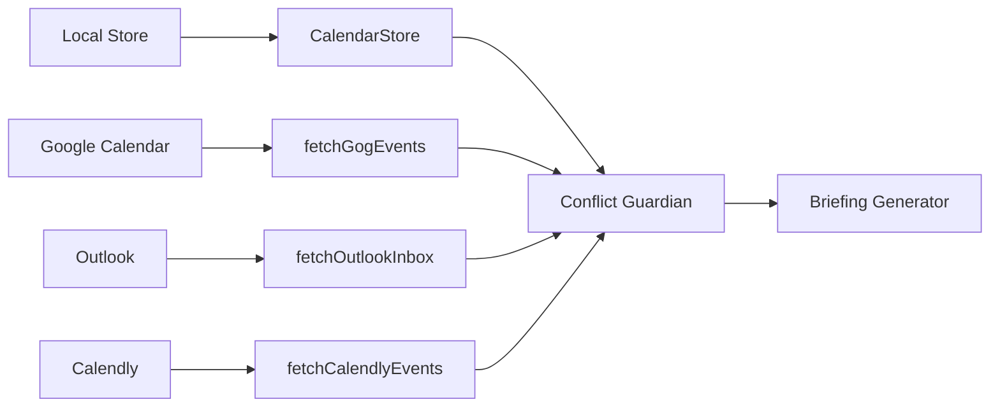

# ClawSecretary - Intelligent Personal Secretary Extension

<p align="center">
  
</p>

<p align="center">
  <strong>An intelligent, proactive secretary extension for OpenClaw</strong>
</p>

<p align="center">
  <a href="https://github.com/ivanintech/ClawSecretary/blob/main/LICENSE">
    
  </a>
  
  
</p>

---

## Table of Contents

1. [Overview](#overview)
2. [Quick Start](#quick-start)
3. [Core Capabilities](#core-capabilities)
4. [Architecture](#architecture)
5. [API Reference](#api-reference)
6. [Modules](#modules)
7. [Configuration](#configuration)
8. [Use Cases](#use-cases)
9. [Development](#development)
10. [Troubleshooting](#troubleshooting)

---

## Overview

**ClawSecretary** is an advanced OpenClaw plugin that transforms your AI assistant into a proactive, intelligent personal secretary. It combines calendar management, email triage, IoT automation, P2P negotiations, and second-brain synchronization into a unified experience.

### Key Features

- **🗓️ Multi-Calendar Management** - Local, Google, Outlook, Calendly sync
- **📧 Intelligent Email Triage** - Automatic prioritization and routing
- **🤖 Proactive Briefings** - Daily summaries delivered automatically
- **🔍 Deep Research** - Web search with multi-provider support
- **💡 IoT Integration** - Philips Hue & Sonos automation
- **🤝 P2P Negotiations** - RSA-encrypted meeting coordination
- **📝 Ghost Write** - Automated closure documentation
- **🧠 Memory Lifecycle** - Context-aware recall across sessions
- **📱 Zero-Config Activation** - Magic Setup via QR code

### Integration Status

| Category | Status | Coverage |
|----------|--------|----------|
| OpenClaw Core APIs | ✅ 98% | 14 runtime APIs |
| Media Understanding | ✅ Complete | Audio/Video processing |
| Web Search | ✅ Complete | Multi-provider |
| Image Generation | ✅ Complete | Native support |
| WhatsApp Channel | ✅ Complete | Interactive messages |
| Text Processing | ✅ Complete | Paragraph-aware chunking |
| Subagent Runtime | ✅ Complete | Parallel execution |
| Memory Lifecycle | ✅ Complete | Hooks integration |
| Activity Tracking | ✅ Complete | IoT analytics |

---

## Quick Start

### Installation

```bash
# Install from local source
cd extensions/secretary
npm install

# Or link to development
npm link
```

### Activation (Magic Setup)

```bash
# Generate magic pairing link
openclaw channels whatsapp connect

# Or use the built-in activation
openclaw pair
```

### Basic Commands

```
/briefing          - Generate daily briefing
/pair             - Generate magic setup link
/status           - Check all service connections
/calendar list     - View local calendar events
/calendar add     - Add new event (with conflict detection)
```

---

## Core Capabilities

### 1. Proactive Calendar Management

The Secretary maintains a unified view of your schedule across multiple sources:



**Key Features:**
- WAL-compliant event persistence in `SESSION-STATE.md`
- Conflict detection with automatic resolution suggestions
- Cross-calendar deduplication
- Autonomy-aware behavior (L1-L4 levels)

### 2. Intelligent Email Triage

Emails are automatically classified and prioritized:

| Priority | Keywords | Action |
|----------|----------|--------|
| 🚨 Critical | urgent, firma, asap | Immediate WhatsApp alert |
| 📧 Normal | newsletter, update | Digest inclusion |
| 🗑️ Low | unsubscribe, promotion | Auto-archive hint |

**Supported Sources:**
- Gmail (via `fetchGmailUnread`)
- Outlook (via Maton API)
- Himalaya CLI (local email)

### 3. Web Intelligence

Powered by OpenClaw's native `runtime.webSearch`:

```typescript
const results = await performWebSearch(query, {
  providerId: "perplexity",  // Optional: auto-detect
  maxResults: 10,
});
```

**Features:**
- Multi-provider auto-detection
- No external API keys required
- Contextual research for meetings
- Opportunity discovery

### 4. IoT Automation

Integrates with physical devices for ambient intelligence:

```typescript
// Focus mode activation
await triggerHueScene(api, "Oficina", "Concentración");
await triggerSonosFocus(api, "Escritorio");

// Activity tracking (automatic via runtime.channel.activity)
const stats = getIoTActivityStats();
// { total: 15, successful: 14, failed: 1, byDevice: { "philips-hue": 10, "sonos": 5 } }
```

### 5. P2P Negotiations

Secure meeting coordination with RSA encryption:

```
┌─────────────┐     RSA-encrypted      ┌─────────────┐
│  Secretary  │◄─────── offer ────────►│   Peer      │
│   (Host)    │                         │  Secretary  │
└─────────────┘                         └─────────────┘
       │                                       │
       │ Calendar check                        │
       ▼                                       ▼
  Slot selection                          Confirmation
  Auto-commit if free                    or counter-propose
```

---

## Architecture

### High-Level Diagram

```
┌─────────────────────────────────────────────────────────────────┐
│                        OpenClaw Gateway                          │
├─────────────────────────────────────────────────────────────────┤
│                                                                  │
│  ┌──────────────┐    ┌──────────────┐    ┌──────────────┐    │
│  │   Tools      │    │   Hooks      │    │  HTTP Routes │    │
│  ├──────────────┤    ├──────────────┤    ├──────────────┤    │
│  │ Calendar     │    │ gateway_start│    │ /wa-webhook  │    │
│  │ WhatsApp     │    │ before_prompt│    │ /trigger     │    │
│  │ Transcription│    │ agent_end    │    │ /oauth-inject│    │
│  │ Image Gen    │    │ message_recv │    │ /negotiate   │    │
│  │ Orchestrator │    │ subagent_end │    │ /activate/*  │    │
│  │ PDF Extract  │    │              │    │              │    │
│  │ Privacy      │    │              │    │              │    │
│  └──────────────┘    └──────────────┘    └──────────────┘    │
│                                                                  │
│  ┌──────────────────────────────────────────────────────────┐  │
│  │                    Secretary Core                          │  │
│  │  ┌────────────────┐  ┌────────────────┐  ┌───────────┐  │  │
│  │  │  Orchestrator │  │  WAL Helpers   │  │  Store    │  │  │
│  │  │  (40 actions) │  │  SESSION-STATE │  │  calendar │  │  │
│  │  └────────────────┘  └────────────────┘  └───────────┘  │  │
│  └──────────────────────────────────────────────────────────┘  │
│                                                                  │
└─────────────────────────────────────────────────────────────────┘
```

### Module Map

```
extensions/secretary/
├── index.ts                          # Plugin entry point (198 lines)
│
├── src/
│   ├── orchestrator.ts               # Main action dispatcher (1180 lines)
│   │   ├── 40+ action handlers
│   │   ├── Proactive hooks
│   │   └── Parallel execution
│   │
│   ├── store.ts                      # Calendar persistence (35 lines)
│   │
│   ├── wal-helpers.ts                # WAL protocol (286 lines)
│   │   ├── Session hierarchy tracking
│   │   ├── Vector memory delegation
│   │   └── SESSION-STATE.md updates
│   │
│   ├── negotiation.ts                 # P2P RSA protocol (180 lines)
│   │   ├── RSA encryption/decryption
│   │   ├── Slot negotiation
│   │   └── Session hierarchy
│   │
│   ├── helpers/
│   │   ├── intelligence.ts            # Web search & research (124 lines)
│   │   ├── iot.ts                    # IoT control + activity tracking (128 lines)
│   │   ├── memory-lifecycle.ts       # Memory hooks (182 lines)
│   │   ├── text-processor.ts         # Native chunking (378 lines)
│   │   ├── knowledge.ts              # Second brain sync (187 lines)
│   │   ├── parallel-subagent-helper.ts # Parallel execution (209 lines)
│   │   ├── pairing.ts                # Magic setup (66 lines)
│   │   ├── alerts.ts                # Urgent notifications
│   │   ├── autonomy.ts              # Autonomy level reader
│   │   ├── calendly.ts              # Calendly API
│   │   ├── common.ts                # CLI execution
│   │   ├── email.ts                 # Email fetching
│   │   ├── tts-voice-selector.ts   # Voice selection
│   │   ├── whatsapp.ts              # WhatsApp utilities
│   │   └── activation.ts            # Zero-config activation
│   │
│   ├── calendar-tool.ts              # Calendar CRUD (175 lines)
│   ├── whatsapp-tool.ts              # WhatsApp messaging (339 lines)
│   ├── transcription-tool.ts         # Audio transcription
│   ├── image-generation-tool.ts      # Image creation
│   ├── pdf-extraction-tool.ts       # PDF processing
│   ├── privacy-tool.ts              # Privacy enforcement
│   ├── vault.ts                     # Secret management
│   ├── crm.ts                       # CRM integrations
│   ├── webhook.ts                    # WhatsApp webhooks
│   ├── oauth-bridge.ts              # Mobile-edge OAuth
│   ├── auto-activator.ts            # Zero-config setup
│   ├── activation-endpoints.ts      # Activation API
│   └── constants.ts                 # Localization
│
└── data/                            # Runtime data
    ├── calendar.json                # Local events
    └── sessions/                   # Subagent sessions
```

---

## API Reference

### OpenClaw Runtime APIs Used

| API | Usage | File |
|-----|-------|------|
| `runtime.mediaUnderstanding.transcribeAudioFile()` | Audio transcription | transcription-tool.ts |
| `runtime.webSearch.runWebSearch()` | Web research | intelligence.ts |
| `runtime.imageGeneration.generate()` | Image creation | image-generation-tool.ts |
| `runtime.tts.listVoices()` | Voice selection | tts-voice-selector.ts |
| `runtime.tts.textToSpeech()` | Voice messages | whatsapp-tool.ts |
| `runtime.subagent.run()` | Parallel execution | parallel-subagent-helper.ts |
| `runtime.subagent.waitForRun()` | Run completion | parallel-subagent-helper.ts |
| `runtime.subagent.getSessionMessages()` | Message retrieval | parallel-subagent-helper.ts |
| `runtime.subagent.deleteSession()` | Session cleanup | wal-helpers.ts |
| `runtime.channel.text.chunkTextWithMode()` | Text chunking | text-processor.ts |
| `runtime.channel.text.chunkMarkdownTextWithMode()` | Markdown chunking | text-processor.ts |
| `runtime.channel.text.convertMarkdownTables()` | Table conversion | text-processor.ts |
| `runtime.channel.text.hasControlCommand()` | Command detection | text-processor.ts |
| `runtime.channel.activity.record()` | IoT tracking | iot.ts |
| `runtime.messaging.send()` | WhatsApp send | whatsapp-tool.ts |
| `api.extractPdfContent()` | PDF extraction | orchestrator.ts |

### Orchestrator Actions

The main orchestrator supports 40+ actions:

#### Calendar & Scheduling
| Action | Description | Hooks |
|--------|-------------|-------|
| `briefing` | Daily agenda + weather + insights | WAL, memory |
| `parallel_briefing` | Concurrent briefing + calendar sync | Subagent |
| `conflict_guardian` | Detect and resolve schedule conflicts | WAL |
| `gog_sync` | Google Calendar synchronization | WAL |
| `calendly_sync` | Calendly bookings import | WAL |

#### Email & Communication
| Action | Description | Hooks |
|--------|-------------|-------|
| `email_concierge` | Outlook triage with alerts | WhatsApp |
| `gmail_triager` | Gmail inbox prioritization | WAL |
| `himalaya_list` | Local email listing | - |
| `himalaya_read` | Email content reading | - |

#### Intelligence & Research
| Action | Description | Hooks |
|--------|-------------|-------|
| `proactive_research` | Web search on topics | WAL |
| `search_opportunities` | Venue/opportunity discovery | WAL |
| `rss_digest` | News feed compilation | WhatsApp |
| `get_personal_context` | Memory recall | WAL |

#### IoT & Automation
| Action | Description | Hooks |
|--------|-------------|-------|
| `trigger_focus_mode` | Hue + Sonos automation | Activity |
| `get_iot_activity` | Activity statistics | Activity |
| `contextual_monitor` | WAL-based monitoring | WAL |

#### Document & Knowledge
| Action | Description | Hooks |
|--------|-------------|-------|
| `ingest_document` | PDF processing + extraction | Vault |
| `sync_knowledge` | Notion/Obsidian sync | VectorDB |
| `finalize_closure` | Ghost write to transcript | Transcript |
| `process_text` | Native text chunking | Text |

#### P2P & Collaboration
| Action | Description | Hooks |
|--------|-------------|-------|
| `negotiate_meeting` | P2P slot negotiation | RSA, Hierarchy |

### Lifecycle Hooks

Registered via `registerProactiveHooks()` and `registerMemoryLifecycleHooks()`:

```typescript
// Gateway lifecycle
api.on("gateway_start", () => { /* Morning briefing setup */ });

// Agent lifecycle
api.on("before_agent_start", (event) => {
  // Inject relevant memories
  return { prependContext: memoryContext };
});

api.on("agent_end", (event) => {
  // Capture task completion
  captureMemoryFromText(api, `Task: ${event.outcome}`);
});

// Message lifecycle
api.on("message_received", (event) => {
  // Financial triage trigger
  if (/factura|pago/.test(event.content)) triggerFinancialCheck();
});

api.on("message_sending", (event) => {
  // Append verification signature
  return { content: `${event.content}\n\n💡 _Verificado con Secretary_` };
});

// Subagent lifecycle
api.on("subagent_ended", (event) => {
  // WAL sync for delegation
  updateSessionState(workspace, "SUBAGENT_SYNC", event.outcome);
});

// Prompt building
api.on("before_prompt_build", (event) => {
  // Inject recent real-world context
  return { appendSystemContext: recentState };
});
```

---

## Modules

### Orchestrator (`orchestrator.ts`)

The central dispatcher for all Secretary actions. Uses a switch-based action router.

**Key Design Patterns:**

1. **Action Enum Pattern** - All 40+ actions defined in `parameters.action.enum`
2. **Handler Method Pattern** - Each action has a dedicated `handle*` method
3. **Context Propagation** - `api`, `store`, `vault`, `crm` passed via constructor
4. **WAL Integration** - Every action updates `SESSION-STATE.md`

```typescript
class SecretaryOrchestrator {
  // Constructor - dependency injection
  constructor(private api: OpenClawPluginApi) {
    this.store = new CalendarStore(api.resolvePath("./data"));
    this.vault = new VaultManager(this.workspaceDir);
    this.crm = new CRMManager();
  }

  // Execute - action dispatch
  async execute(runId, params, ctx?) {
    switch (params.action) {
      case "briefing": return this.handleBriefing(runId, params, apiKey);
      case "parallel_briefing": return this.handleParallelBriefing();
      // ... 38 more actions
    }
  }
}
```

### WAL Helpers (`wal-helpers.ts`)

Implements the Write-Ahead Logging protocol for persistent state.

**WAL Protocol Principle:**
> "STOP and PERSIST before you REPLY."

**SESSION-STATE.md Structure:**
```markdown
# Active Working Memory (WAL) 🦞

**Status**: READY

---

## SessionHierarchy
### [2026-03-18T10:30:00Z] orchestrator session "secretary-briefing" started (depth=1)

## Last Sync
### [2026-03-18T10:25:00Z] Synced 5 gog events.

## Conflicts
### [2026-03-18T09:15:00Z] Collision: "Review" vs "Team Standup"

## IoT
### [2026-03-18T10:00:00Z] Triggered focus: Oficina/Concentración

## Closure
### [2026-03-18T11:30:00Z] Finalized: Meeting notes summary...
```

**Session Hierarchy Tracking:**
```typescript
interface SessionHierarchyEntry {
  sessionKey: string;
  role: "orchestrator" | "leaf" | "peer";
  spawnDepth: number;
  parentSessionKey?: string;
  childSessionKeys: string[];
  createdAt: string;
  status: "active" | "completed" | "failed";
  metadata?: Record<string, unknown>;
}
```

### Negotiation (`negotiation.ts`)

P2P meeting coordination with RSA encryption.

**Flow:**
1. Peer generates offer with proposed time slots
2. Offer encrypted with our public RSA key
3. We decrypt and check against our calendar
4. Accept first free slot OR reject with reason
5. Reply encrypted with peer's public key

**Security Features:**
- RSA-2048 encryption for all P2P payloads
- No shared secrets required
- Session hierarchy for negotiation tracking

### Memory Lifecycle (`memory-lifecycle.ts`)

Context-aware memory across agent sessions.

**Hook Implementation:**
```typescript
api.on("before_agent_start", async (event) => {
  const relevant = recallRelevantMemories(event.prompt.slice(0, 200), 3);
  if (relevant.length > 0) {
    return {
      prependContext: formatMemoriesForContext(relevant)
    };
  }
});

api.on("agent_end", async (event) => {
  captureMemoryFromText(api, `Completed: ${event.outcome}`, "agent_end");
});
```

**Memory Categories:**
- `preference` - User likes/dislikes
- `decision` - Choices made
- `fact` - Factual information
- `entity` - People, contacts
- `other` - Uncategorized

**Security:**
- Prompt injection detection with rejection

### Text Processor (`text-processor.ts`)

Native OpenClaw text processing integration.

**Key Functions:**
```typescript
// Paragraph-aware chunking (upstream feature)
const chunks = chunkByParagraph(text, 4000, { splitLongParagraphs: true });

// Markdown-safe chunking
const chunks = chunkMarkdownForWhatsApp(api, markdown, 4000, "length");

// Table conversion for channels
const whatsapp = convertTablesForChannel(api, markdown, "whatsapp");

// Dynamic limits per channel
const limit = resolveTextChunkLimit(api, "whatsapp"); // 4000
const limit = resolveTextChunkLimit(api, "telegram");  // 4096
```

### Parallel Subagent Helper (`parallel-subagent-helper.ts`)

Concurrent task execution using OpenClaw's subagent runtime.

**Pattern:**
```typescript
const results = await executeParallelSubagents(api, [
  {
    message: "Generate briefing",
    sessionKey: "secretary-briefing",
    extraSystemPrompt: "You are an executive assistant..."
  },
  {
    message: "Sync calendar",
    sessionKey: "secretary-calendar-sync"
  }
]);

// Results include runId, sessionKey, success, messages
```

**Pre-built Scenarios:**
- `ParallelScenarios.briefingAndCalendarSync()`
- `ParallelScenarios.analyzeMultipleEmails(emails)`
- `ParallelScenarios.parallelResearch(topics)`

### IoT (`iot.ts`)

Smart home integration with activity tracking.

**Devices Supported:**
- Philips Hue (via `openhue` CLI)
- Sonos (via `sonos` CLI)

**Activity Recording:**
```typescript
// Automatic via runtime.channel.activity
await recordIoTActivity(api, {
  device: "philips-hue",
  action: "set_scene",
  target: "Oficina/Concentración",
  success: true,
  timestamp: new Date().toISOString()
});

// Query stats
const stats = getIoTActivityStats();
// { total: 15, successful: 14, failed: 1, byDevice: {...} }
```

### Knowledge (`knowledge.ts`)

Second brain synchronization.

**Sync Targets:**
1. **VectorDB (LanceDB)** - via `storeVectorMemory()`
2. **Obsidian** - Local vault markdown files
3. **Notion** - Database pages via API

**Ghost Write Flow:**
```typescript
const { transcript, knowledge, chunkInfo } = await syncGhostWriteToSecondBrain(
  api,
  "Meeting Closure 2026-03-18",
  "Discussed Q1 targets...",
  sessionKey
);
// transcript: appendAssistantMessageToSessionTranscript()
// knowledge: synced to VectorDB + Notion + Obsidian
// chunkInfo: { totalChunks, wordCount }
```

---

## Configuration

### Environment Variables

```bash
# Calendar Sync
GOG_ACCOUNT=your@gmail.com

# Email
MATON_API_KEY=          # Outlook via Maton
CALENDLY_API_KEY=      # Calendly bookings

# Knowledge
NOTION_API_KEY=        # Notion sync
NOTION_DATABASE_ID=    # Target database
OBSIDIAN_VAULT_PATH=   # Local vault path

# IoT
HUE_BRIDGE_IP=         # Philips Hue bridge
SONOS_SPEAKER=         # Default speaker

# Personalization
USER_CITY=Madrid       # Weather location
WA_DEFAULT_PHONE=      # Default WhatsApp recipient

# Security
SAAS_BRIDGE_TOKEN=     # Mobile-edge OAuth
```

### OpenClaw Config Integration

The Secretary auto-detects:
- WhatsApp channel configuration
- Calendly OAuth via `resolveApiKeyForProvider`
- Google Places auth profiles
- Vector memory (LanceDB/qmd)

---

## Use Cases

### 1. Morning Briefing

```
08:00 → Cron triggers
       ↓
Gmail triage (20 unread)
RSS digest (top 5)
Weather check (Madrid)
Calendar merge (local + gog + calendly)
       ↓
Briefing generated with insights
       ↓
WhatsApp sent with buttons:
  [Confirm] [Get Tip] [Nearby Places]
```

### 2. Meeting Closure Ghost Write

```
Meeting ends
       ↓
Agent captures summary
       ↓
/finalize_closure action triggered
       ↓
Ghost Write pipeline:
  1. chunkByParagraph() - Document segmentation
  2. appendAssistantMessageToSessionTranscript() - Audit trail
  3. syncKnowledge() - VectorDB + Notion + Obsidian
       ↓
SESSION-STATE.md updated
```

### 3. P2P Schedule Negotiation

```
Peer sends encrypted offer
  { slots: ["09:00-10:00", "14:00-15:00"] }
       ↓
Decrypt with RSA private key
Check against calendar store
       ↓
[If free] Auto-commit event
[If busy] Send rejection with reason
       ↓
Reply encrypted to peer
```

### 4. Focus Mode Activation

```
User: "Start focus mode"
       ↓
/trigger_focus_mode action
       ↓
Parallel execution:
  • triggerHueScene("Oficina", "Concentración")
  • triggerSonosFocus("Escritorio")
       ↓
Activity recorded to runtime.channel.activity
       ↓
SESSION-STATE.md: "Triggered focus: Oficina/Concentración"
```

### 5. Memory-Enhanced Context

```
Before agent start
       ↓
Hook: before_agent_start
Recall relevant memories (query: user's recent topics)
       ↓
Prepend context:
  === RELEVANT MEMORIES ===
  ### Preferences
  - Prefiere reuniones de max 45 min
  ### Decisions
  - [2026-03-15] Decided to postpone vacation
  ### Facts
  - Current project: Q1 launch
  ===================
       ↓
Agent starts with enhanced context
```

---

## Development

### Project Structure

```
extensions/secretary/
├── src/
│   ├── *.ts              # Source modules
│   └── helpers/          # Utility functions
├── data/                 # Runtime data (gitignored)
├── assets/               # Images, logos
├── *.md                  # Documentation
├── package.json
└── openclaw.plugin.json  # Plugin manifest
```

### Adding New Actions

1. Add action name to `orchestrator.parameters.action.enum`
2. Create `handle*` method in `SecretaryOrchestrator`
3. Add case to `execute()` switch
4. (Optional) Add WAL update in handler
5. (Optional) Register proactive hook

```typescript
// Example: Adding "my_action"
case "my_action": return this.handleMyAction(params);

// Add to enum
enum: [..., "my_action"]

// Create handler
private async handleMyAction(params: any) {
  await updateSessionState(this.workspaceDir, "MyModule", "Did something");
  return { content: [{ type: "text", text: "Done!" }] };
}
```

### Testing

```bash
# Run extension tests
pnpm test -- extensions/secretary

# Build for production
pnpm build

# Check types
pnpm tsgo
```

### Code Style

- TypeScript strict mode
- ESM modules
- Semantic naming (Spanish for user-facing, English for code)
- WAL comments on state changes
- Error handling with graceful fallbacks

---

## Troubleshooting

### Common Issues

| Issue | Solution |
|-------|----------|
| WhatsApp not sending | Check `channels.whatsapp.enabled` in config |
| Calendar not syncing | Verify `GOG_ACCOUNT` env var |
| IoT commands failing | Ensure `openhue`/`sonos` CLI installed |
| Memory recall empty | Check `before_agent_start` hook registration |
| P2P negotiation timeout | Verify public key exchange |

### Debug Mode

```bash
# Enable verbose logging
DEBUG=secretary:* openclaw gateway run

# Check session state
cat workspace/SESSION-STATE.md

# View activity log
curl http://localhost:18789/plugins/secretary/activate/status
```

### Log Locations

- Gateway: `~/.openclaw/logs/gateway.log`
- Secretary: Console output with `[Secretary]` prefix
- WAL: `workspace/SESSION-STATE.md`

---

## Interesting Implementation Details

### 1. Zero-Configuration Philosophy

The Secretary auto-detects API keys and credentials:
```typescript
const auth = await resolveApiKeyForProvider({
  provider: "calendly",
  cfg,
});
// Falls back to env vars if auth profiles unavailable
```

### 2. WAL-Compliant Persistence

Every state-changing action updates SESSION-STATE.md:
```typescript
await updateSessionState(workspaceDir, "Module", "Action taken");
// Format: ## Module\n### [timestamp] Action taken
```

### 3. Autonomy Levels

Behavior adapts based on event title prefixes:
- `L3:` - Auto-resolve conflicts
- `L4:` - Full autonomous decision making
- Default - Prompt user confirmation

### 4. Paragraph-Aware Chunking

Documents split on paragraph boundaries, preserving meaning:
```typescript
const chunks = chunkByParagraph(text, 4000, { splitLongParagraphs: true });
// Better than naive character splitting
```

### 5. RSA P2P Security

No shared secrets - each party has keypair:
```typescript
// Encrypt for peer
publicEncrypt(peerPublicKey, JSON.stringify(offer))

// Decrypt locally
privateDecrypt(privateKey, encryptedBase64)
```

---

## Contributing

1. Fork the repository
2. Create feature branch (`git checkout -b feature/amazing`)
3. Commit changes (`git commit -m 'Add amazing feature'`)
4. Push to branch (`git push origin feature/amazing`)
5. Open Pull Request

### Guidelines

- Follow existing code style
- Add tests for new actions
- Update documentation (this file)
- Use Conventional Commits

---

## License

MIT License - see [LICENSE](LICENSE) file.

---

<p align="center">
  <strong>ClawSecretary</strong> - Your AI-Powered Personal Secretary 🦞
</p>

<p align="center">
  Built with ❤️ for OpenClaw
</p>
